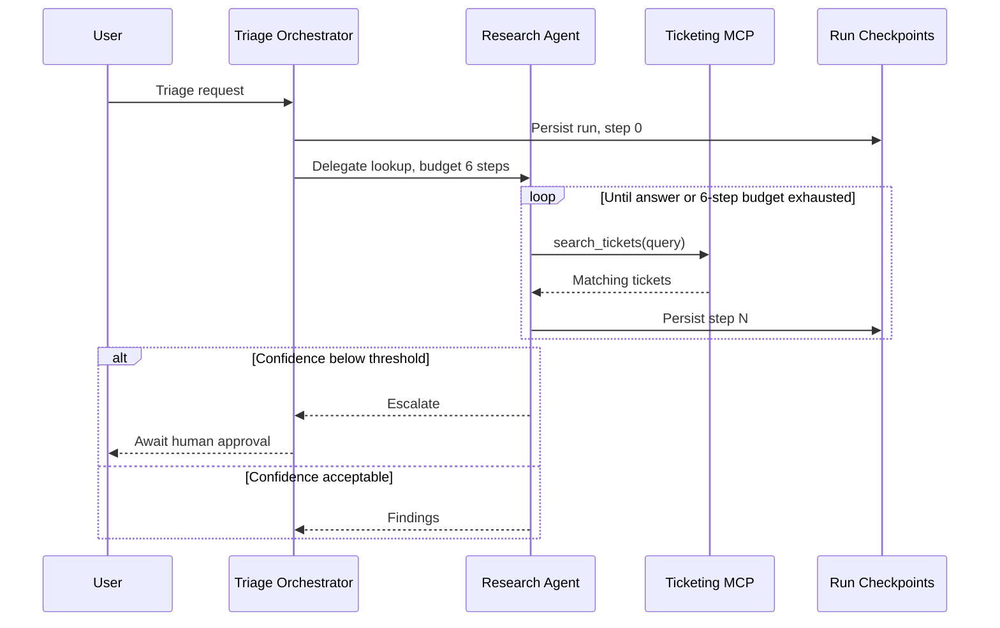

# Agentic System Design

Two rules govern everything below. **Design before you draw**: a diagram cannot rescue an architecture that has no stated termination condition. And **the design lives in text**: Mermaid in the repository is the source of truth, and any rendering of it, including a Figma board, is derived from it.

This skill decides *what the system is and what its diagram must say*. How that diagram is laid out, styled, and generated in Figma is [figma-draw-standards](../figma-draw-standards/SKILL.md). They change for different reasons: a new agent pattern changes this skill, and a rendering or legibility problem changes that one.

## Scope

This skill governs **architecture designs** and their L1, L2, and L3 diagrams. Project plan documents link to or embed these files rather than drawing their own (see [agentic-project-planning](../agentic-project-planning/SKILL.md)). A Mermaid diagram that only illustrates a process inside a document, such as a run-state machine or an improvement loop, is not an architecture diagram and must never stand in for the L2.

## Non-negotiables

Every agentic design, and every architecture diagram of one, must satisfy all of these:

- [ ] Uses the canonical pattern vocabulary below — no invented names for known patterns
- [ ] States whether it is a workflow or an agent, and which rung, in the title
- [ ] Every agent has one responsibility, stated in one sentence, and a `<Role>Agent` name
- [ ] Every component is classified: who runs it, whether its state is durable, whether a model decides inside it
- [ ] Every loop shows its termination condition: step cap, token/cost budget, or wall clock
- [ ] Every tool edge names the side effect and whether it is read-only or mutating
- [ ] Human-in-the-loop gates and guardrails appear as nodes, never as prose in a caption
- [ ] The Mermaid source is committed under `wiki/diagrams/` in the same change as the design
- [ ] The diagram carries a level (L1/L2/L3), an owner, and a date

## Choose the pattern before the picture

Climb this ladder one rung at a time. Start at the top and stop at the first rung that solves the problem. Autonomy is a cost — it buys flexibility and pays in latency, spend, and debuggability.

| Rung | Pattern | Use when |
|------|---------|----------|
| 1 | Single augmented LLM | One call with retrieval, tools, or memory is enough |
| 2 | Prompt chaining | The task decomposes into fixed sequential steps with checks between them |
| 3 | Routing | Inputs fall into classes that deserve different prompts or models |
| 4 | Parallelization | Independent subtasks (sectioning), or repeated votes for confidence |
| 5 | Orchestrator-workers | Subtasks cannot be known until runtime |
| 6 | Evaluator-optimizer | Output quality is judgeable and iteration measurably improves it |
| 7 | Autonomous agent | The path is open-ended and environmental feedback must steer each step |

Use these names exactly. They are the industry-canonical set; renaming them costs every reader the ability to recognize what they already know.

Classify by who controls the next step, rather than the rung number alone. Fixed prompt chains, routing, and parallel branches are workflows. Orchestrator-workers and evaluator-optimizer can be workflows or agents depending on whether code fixes the path or the model chooses it. An agent directs its process using environmental feedback. Say which one a design is, in the diagram title. The distinction determines how it is tested and what can go wrong. Patterns compose: name each one that appears, for example "orchestrator-workers wrapping an evaluator-optimizer".

Climb a rung only when a measurement forces you to. "It might need to plan" is not a measurement. Record the measurement in the design notes.

## Classify every component

Answer three questions for every box before drawing it. They are the questions that operations, security, and testing will ask later, and frameworks tend to hide the answers.

| Question | Answers | Rule |
|---|---|---|
| Who runs it? | Us, or a third party | Agents, orchestrators, guardrails, evaluators, and self-hosted tool servers are **code we deploy**. The model provider, vendor tool servers, and SaaS APIs are **third parties**, with their own rate limits, outages, and bills |
| Is its state durable? | Durable, ephemeral, or none | Memory and run checkpoints are **durable state** with a retention policy and a growth curve, even when a framework bundles them into the agent object. Caches and working memory are ephemeral: say what a restart loses |
| Does a model decide inside it? | Model-driven, or deterministic | Mark every model-driven box. That mark separates what can be unit-tested from what must be evaluated |

A guardrail is its own component, not part of the entry point: it can fail independently. A human approval gate is a component with a defined waiting state, not a blocked request. How these classes map to Figma lanes, shapes, and borders is in [figma-draw-standards](../figma-draw-standards/SKILL.md).

## What every agentic design must show

A traditional architecture diagram shows structure. An agentic one must also show **control, cost, and containment**, because those are where these systems actually fail. Eight things:

1. **Trigger and goal** — what starts a run, and what "done" means
2. **The augmented LLM** — model, tools, memory, and retrieval as distinct attachments
3. **Control flow** — who decides the next step: code, or a model
4. **State** — what survives a step, a run, and a process restart
5. **Tool boundaries** — every tool with its side effect and blast radius
6. **Termination and budget** — the step cap or spend limit on every loop
7. **Human gates** — approval points, and what happens while waiting
8. **Observability** — where traces and spans are emitted

If a box has no answer for 3 and 6, it is not designed yet. Unbounded loops, context overflow, and uninspectable decisions are design failures, not model failures — so they must be visible in the design.

Every edge says what it does and carries its qualifier: the side effect (`read-only`, `mutating`) or the bound (`max 6 steps`, `max 2 rounds`). When every agent calls the same provider with the same configuration, that is one relationship, not one per agent. Show separate model relationships only where the model or its configuration actually differs.

## Three levels, drawn separately

Borrow C4's discipline of separate levels; do not try to draw one diagram that serves all three. Each level has an audience and a diagram type.

| Level | Shows | Audience | Diagram type |
|-------|-------|----------|--------------|
| **L1 Context** | The system as one box, its users, and external systems | Stakeholders | Architecture flowchart |
| **L2 Topology** | Agents, orchestrators, stores, queues, providers | Engineers | Architecture flowchart |
| **L3 Loop** | One run, step by step, with tool calls and gates | Implementers | Sequence diagram |

Write L1 and L2 in the renderable architecture form defined in [figma-draw-standards](../figma-draw-standards/SKILL.md), so any `.mmd` file can be generated without rewriting. A worked L2 is there.

## Mermaid is the source of truth

Commit the Mermaid at `wiki/diagrams/<system>-l<level>.mmd` in the same change as the design.

This is not bureaucracy. A diagram that exists only in a drawing tool drifts from the code silently, cannot be reviewed in a pull request, and cannot be regenerated when a service is renamed. A Mermaid file diffs like code.

Any hand edit to a rendering is ported back to the `.mmd` file in that session, or discarded. A rendering that has diverged from its source is worse than no diagram, because it is still trusted.

For implemented components, source names from the code using `rg`. For a new design, use names from the agreed plan and mark them proposed; do not imply they already run. Ask only when an unresolved choice changes the architecture. An initialization `ConnectionAgent` is a single-call diagnostic workflow despite its class name; it has no autonomous loop, tools, memory, or business authority.

## Sequence diagrams for the loop

L3 shows one run. Put the budget in the `loop` label and the gate in an `alt`:

Anything that matters goes in a message label or a `loop`/`alt` label, not in a side note. Renderers differ in what annotations they keep.

## Review checklist

Before a design is shared or merged:

- [ ] The title names the pattern(s), and says workflow or agent
- [ ] Every agent has one responsibility and a `<Role>Agent` name
- [ ] Every component is classified: who runs it, durability, model-driven or not
- [ ] All eight must-shows are answered, with 3 (control flow) and 6 (termination) on every box that needs them
- [ ] Every loop states its bound; every tool edge states its side effect
- [ ] Human gates and guardrails are nodes
- [ ] The `.mmd` source is committed under `wiki/diagrams/`, with level, owner, and date
- [ ] Names match the code — grep one to confirm

When the diagram is rendered in Figma, also run the [figma-draw-standards](../figma-draw-standards/SKILL.md) checklist.

## Detailed reference

Rationale, the failure modes each rule prevents, and a worked before/after: [wiki/2-design/agentic-system-design.md](../../../wiki/2-design/agentic-system-design.md).

Decision sheets (placeholders until filled): [wiki/catalog/](../../../wiki/catalog/README.md#architecture).

Lanes, notation, Mermaid rendering constraints, and board generation: [figma-draw-standards](../figma-draw-standards/SKILL.md).
