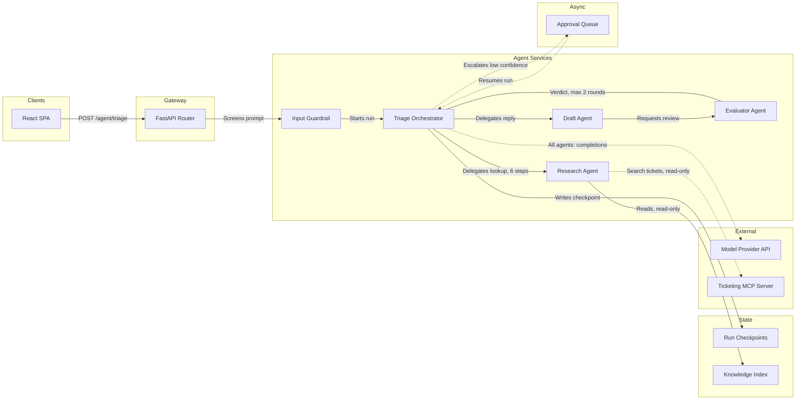

# Figma Draw Standards

**Drawing is not designing.** A design system is a component library optimized for reuse and handoff to code; its palette carries brand. A drawing standard is a *notation* optimized for one thing: a reader decoding the system correctly, at a glance, without a caption. Its palette carries meaning, not brand.

Never mix them. Do not put product brand colors on a diagram, and do not put this palette in the product UI.

The content of every diagram — the pattern, the component classification, the eight must-shows, the levels, and the Mermaid source of truth in `wiki/diagrams/` — comes from [agentic-system-design](../agentic-system-design/SKILL.md). This skill turns that design into a correct, legible Figma board.

## The six lanes

The Figma architecture layout accepts exactly six subgraph IDs, and every node must sit inside one. These are fixed by the tool — treat them as the vocabulary. Each lane follows from how the design classified the component: who runs it, and whether it is durable.

| Lane | Contains | In an agentic system |
|------|----------|----------------------|
| `client` | User surfaces | Web app, CLI, chat surface |
| `gateway` | Entry and admission | API routes, authn/z, rate limits |
| `service` | Compute you deploy | Orchestrators, agents, tool executors, guardrails, evaluators |
| `datastore` | Durable state | Run checkpoints, memory, vector index, SQLite |
| `external` | Systems you do not run | Model provider APIs, third-party MCP servers, SaaS tools |
| `async` | Decoupled messaging | Event bus, job queues, the human approval queue |

Agents, guardrails, and evaluators are all `service` — they are code you deploy. The model provider is always `external`. Memory and checkpoints are `datastore`, never `service`, even when a framework bundles them.

Only these edges are legal — anything else must be mediated by a `service`:

`client→gateway` · `gateway→service` · `service→service` · `service→datastore` · `service↔async` · `service→external`

Note what this forbids: `gateway→gateway`. A guardrail that screens input is a `service`, not a second gateway node.

## The four encoding channels

Meaning is carried by four orthogonal channels. Each one says exactly one thing. Do not overload them.

| Channel | Encodes | Notes |
|---------|---------|-------|
| **Position** (lane) | Who runs it | Primary and unambiguous — lanes are columns |
| **Shape** | What kind of thing it is | Primary — survives grayscale and color blindness |
| **Color** | Reinforces the lane | **Redundant by design** — never the only signal |
| **Border** | Determinism and blast radius | Double = model-driven, 4px = mutating |

Color is deliberately the weakest channel. Six categories is at the limit of reliable color discrimination under color blindness, so the palette confirms what position and shape already said. A correct diagram stays correct printed in grayscale.

The specific subtype is carried in the **label**, not in a new shape. One shape per category, stereotype in the text.

## Label format

```
Name (stereotype)
qualifier line
```

- **Name** matches the code. Grep it before drawing it.
- **Stereotype** is the subtype from the catalog: `agent`, `vector`, `mcp`, `queue`.
- **Qualifier** carries the bound or side effect: `max 6 steps`, `read-only`, `PII`.

Write it as `Name (stereotype)` in Mermaid — parentheses inside a quoted label are safe. In Figma, the stereotype renders as an 11px uppercase line above the name.

No emojis anywhere, in Mermaid or on canvas.

## Palette

Six lane hues, derived by maximizing worst-case separation across normal, protanopic, deuteranopic and tritanopic vision. Every value below is measured, not estimated — see [the wiki page](../../../wiki/2-design/figma-draw-standards.md) for the verification.

| Lane | Hue | Fill (tint) | Border (stroke) | Filled (solid) |
|------|-----|-------------|-----------------|----------------|
| `client` | Indigo | `#E4DFFC` | `#785EF0` | `#785EF0` |
| `gateway` | Red | `#FCE0E4` | `#D65C6B` | `#BE525F` |
| `service` | Blue | `#E0EBF5` | `#5C8AB8` | `#5179A1` |
| `datastore` | Green | `#D3E7D6` | `#228833` | `#228833` |
| `external` | Gold | `#FFEFCC` | `#B87F00` | `#9E6D00` |
| `async` | Purple | `#EED6E4` | `#AA3377` | `#AA3377` |

| Role | Fill | Border | Use |
|------|------|--------|-----|
| Annotation | `#FBF6C4` | `#8A7B00` | Budget chips, callouts, caveats |
| Neutral | `#F2F2F2` | `#595959` | Trust boundaries, trace sinks, legend |

Ink is `#1A1A1A` on tints, `#FFFFFF` on solids. Canvas is `#FFFFFF`.

Every combination clears WCAG: label text ≥ 4.5:1, borders and connectors ≥ 3:1.

**Color follows the lane, never the subtype.** A self-hosted MCP server is blue because we run it; a vendor's is gold because they do. Same shape, different lane, different color — and that difference is the information.

## Component catalog

Shape is fixed per row. Color comes from the lane. `Mermaid` is the plain-flowchart syntax; see the constraint below for architecture layouts.

### client — indigo

| Component | Stereotype | Shape | Mermaid |
|-----------|-----------|-------|---------|
| End user | `actor` | Stadium + person glyph | `id([Name])` |
| Reviewer, approver | `actor` | Stadium + person glyph | `id([Name])` |
| Web app | `web` | Rectangle | `id[Name]` |
| Mobile app | `mobile` | Rectangle | `id[Name]` |
| CLI | `cli` | Rectangle | `id[Name]` |
| Chat surface | `chat` | Rectangle | `id[Name]` |

### gateway — red

| Component | Stereotype | Shape | Mermaid |
|-----------|-----------|-------|---------|
| API route, router | `api` | Hexagon | `id{{Name}}` |
| Authn / authz | `auth` | Hexagon + lock glyph | `id{{Name}}` |
| Rate limit, quota | `limit` | Hexagon | `id{{Name}}` |
| Webhook receiver | `webhook` | Hexagon | `id{{Name}}` |

### service — blue

The largest lane. **Double border means a model decides something inside this box.** That one mark separates the testable parts of the system from the probabilistic ones.

| Component | Stereotype | Shape | Mermaid |
|-----------|-----------|-------|---------|
| Deterministic service | — | Rounded rect | `id(Name)` |
| Agent | `agent` | Rounded rect, **double border** | `id[[Name]]` |
| Orchestrator, supervisor | `orchestrator` | Rounded rect, **double border** | `id[[Name]]` |
| Router, classifier (model) | `router` | Rounded rect, **double border** | `id[[Name]]` |
| Evaluator, judge, critic | `evaluator` | Rounded rect, **double border** | `id[[Name]]` |
| Guardrail, input | `guard-in` | Rounded rect + shield glyph | `id(Name)` |
| Guardrail, output | `guard-out` | Rounded rect + shield glyph | `id(Name)` |
| Tool executor, sandbox | `sandbox` | Rounded rect, dashed inner edge | `id(Name)` |
| Retriever | `retriever` | Rounded rect | `id(Name)` |
| Deterministic code step | `fn` | Rounded rect | `id(Name)` |
| Scheduler | `cron` | Rounded rect + clock glyph | `id(Name)` |
| Self-hosted MCP server | `mcp` | **Notched rect (socket)** | `id>Name]` |
| Human approval gate | `human-gate` | Diamond + person glyph | `id{Name}` |
| Decision branch | `decision` | Diamond | `id{Name}` |

### datastore — green

All durable state is a cylinder. The stereotype says which kind, because the operational questions — retention, growth, what a restart loses — differ completely between them.

| Component | Stereotype | Shape | Mermaid |
|-----------|-----------|-------|---------|
| Relational database | `sql` | Cylinder | `id[(Name)]` |
| Vector index | `vector` | Cylinder, banded top | `id[(Name)]` |
| Cache, key-value | `cache` | Cylinder, dashed border | `id[(Name)]` |
| Object, blob storage | `blob` | Cylinder, wide | `id[(Name)]` |
| Run checkpoint, state | `state` | Cylinder + flag glyph | `id[(Name)]` |
| Working memory | `mem-working` | Cylinder, dashed border | `id[(Name)]` |
| Episodic memory | `mem-episodic` | Cylinder | `id[(Name)]` |
| Semantic memory | `mem-semantic` | Cylinder | `id[(Name)]` |
| Profile, preference memory | `mem-profile` | Cylinder | `id[(Name)]` |
| Prompt, config registry | `registry` | Cylinder | `id[(Name)]` |

Working memory and cache are dashed because they are ephemeral — a restart loses them. That is a property worth seeing.

### external — gold

| Component | Stereotype | Shape | Mermaid |
|-----------|-----------|-------|---------|
| Model provider | `model` | **Circle** | `id((Name))` |
| Third-party MCP server | `mcp` | **Notched rect (socket)** | `id>Name]` |
| Third-party SaaS API | `api` | Stadium | `id([Name])` |
| Internal system we do not own | `system` | Stadium | `id([Name])` |

The model provider is a circle — the one external every agentic diagram has, given the shape nothing else uses, so it is found instantly.

MCP servers keep the notched "socket" shape in **both** lanes. The notch says *protocol boundary exposing tools*; the color says who operates it.

### async — purple

| Component | Stereotype | Shape | Mermaid |
|-----------|-----------|-------|---------|
| Event bus, topic | `topic` | Parallelogram | `id[/Name/]` |
| Job queue | `queue` | Parallelogram | `id[/Name/]` |
| Approval queue | `approval` | Parallelogram + person glyph | `id[/Name/]` |
| Stream | `stream` | Parallelogram | `id[/Name/]` |
| Scheduled trigger | `timer` | Parallelogram + clock glyph | `id[/Name/]` |

### Annotations — not nodes

| Element | Shape | Use |
|---------|-------|-----|
| Budget chip | Annotation pill | `max 6 steps`, `<= $0.05/run`, `p95 < 3s` |
| Caveat, open question | Annotation sticky | Unresolved design decisions |
| Trust boundary | Neutral dashed container | Where data leaves our control |
| Data classification | Small tag on the node | `PII`, `secret` |
| Trace sink | Neutral rect, `otel` | Where spans are emitted |
| Legend | Neutral frame | Mandatory on every board |

## Borders

| Treatment | Meaning |
|-----------|---------|
| 2px solid | Deterministic code we run — the default |
| 2px **double** | A model makes a decision inside |
| 2px dashed | Ephemeral, or operated by a third party |
| **4px** any style | **Mutating: irreversible or externally visible side effect** |

The 4px rule is the highest-value mark on the board. Scanning for thick borders answers "what can this system actually break?" in about two seconds, and that is the first question any reviewer has.

## Edges

| Meaning | Mermaid | Figma |
|---------|---------|-------|
| Synchronous internal call | `-->` | 2px solid, arrow |
| Bidirectional stream | `<-->` | 2px solid, both arrows |
| Return, feedback upstream | `<---` | 2px solid, arrow |
| Async or external | `-.->` | 2px dashed, arrow |

**Every edge carries a label.** An unlabeled edge is an unfinished thought. The grammar is `verb object, qualifier`:

- `Writes order, mutating`
- `Reads index, read-only`
- `Delegates lookup, max 6 steps`
- `Verdict, max 2 rounds`

Edge color is the neutral stroke `#595959`, never a lane color. Connectors that inherit node colors turn a busy diagram into confetti.

## Two tiers

**Tier A — generated.** Mermaid to FigJam via `generate_diagram`. Layout and shapes come from the generator; apply lane colors and annotations afterward. In an **architecture-layout** diagram the shape vocabulary does not apply — use plain `id["Name (stereotype)"]` for every node and let lane position plus the stereotype carry the kind. The richer shapes above apply to plain flowcharts and to Tier B.

**Tier B — the Figma library.** Hand-built components with the full shape and glyph set, for diagrams that will be presented or published. Build Tier B by styling a Tier A generation once, then publishing the result — never by drawing from scratch.

## Architecture-layout Mermaid

Every L1/L2 file in `wiki/diagrams/` is written to these rules so it can always be generated. They come from the tool, not from taste. Violating them produces a failed render or a wrong layout:

- `flowchart LR` only. `TD`/`TB` are not supported.
- Every node inside a lane subgraph. A node outside one has no lane and cannot be placed.
- Node IDs in camelCase. No spaces. **Underscores break routing.**
- Never draw an edge to a subgraph ID — only to nodes.
- Forward (`-->`) and bidirectional (`<-->`) edges must form a DAG. Express a cycle with a backward edge (`<---`), left-positioned node written first.
- **Every edge touching `async` or `external` must be dotted (`-.->`).** `<-.->` is unsupported — use two dotted edges.
- No duplicate edges between the same pair; merge into one labeled edge.
- Every `service` node needs at least one incoming and one outgoing edge. Walk them one at a time before generating.
- No emojis, no HTML tags, no `\n` escapes. Avoid the reserved IDs `end`, `subgraph`, `graph`. Quote labels containing special characters: `api["Router (v2)"]`.

When every agent calls the same provider with the same configuration, draw **one** edge labeled `"All agents: completions"` rather than one per agent. A diagram whose every node connects to the provider teaches nothing.

**Unsupported diagram types.** Do not request C4 notation from the Figma diagram tool — it is explicitly unsupported, along with class diagrams, mindmaps, timelines, and pie charts. Express the design's levels with architecture flowcharts (L1, L2) and sequence diagrams (L3).

**Sequence diagrams.** `Note over`, `Note left of`, and `Note right of` are **silently stripped** by the generator. If an annotation matters, fold it into a message label, or add it in Figma as a sticky note after generating.

### Worked L2

The design's triage example, in renderable form:



Every loop carries its bound (`6 steps`, `max 2 rounds`), every tool edge says whether it mutates, the human gate is a node, and the evaluator loop is a backward edge rather than a forward cycle. The committed copy is [`wiki/diagrams/triage-agent-l2.mmd`](../../../wiki/diagrams/triage-agent-l2.mmd).

## Figma library conventions

**Component names**, broad to narrow, so Figma's slash nesting produces a navigable tree:

```
Node / Service / Agent
Node / Datastore / Vector
Node / External / MCP Server
Edge / Async
Annotation / Budget Chip
```

**Variables** mirror the palette exactly — `diagram/lane/service/tint`, `diagram/lane/service/stroke`. Import [`wiki/diagrams/draw-tokens.json`](../../../wiki/diagrams/draw-tokens.json) rather than typing hex values. A node with a hard-coded fill cannot be restyled and will drift.

**Auto layout on every node component**, hugging contents with 12px vertical and 16px horizontal padding. Without it the label cannot grow and the component is a static snapshot.

**Geometry:** 8px grid, 8px corner radius, node min-width 160px, 48px horizontal and 32px vertical spacing between nodes.

**Type:** 14px medium for the name, 11px uppercase for the stereotype, 11px regular for the qualifier. One family throughout.

**Layer names are semantic** — `TriageOrchestrator`, never `Rectangle 47`. Anything reading the file back, a teammate or an agent, depends on them.

## Board structure

**One canonical board per system**, not one per person. Keep drafts in your own file and generate into the canonical `fileKey` only once reviewed. Pages in order:

```
Cover        title, owner, status, last-updated
L1 Context
L2 Topology
L3 Loop
Archive      superseded versions, dated
```

Status values are fixed: `Draft`, `In review`, `Current`, `Superseded`. Nobody invents their own.

**Every board carries a legend frame** showing the six lanes, the four border treatments, solid versus dashed edges, the owner, and the date. A diagram without a date is assumed stale.

## Generating the board

1. Validate the `.mmd` against [Architecture-layout Mermaid](#architecture-layout-mermaid) first.
2. Load Figma's own `figma-generate-diagram` skill. It is a **mandatory prerequisite** for every `generate_diagram` call; skipping it causes preventable render failures.
3. Do **not** call `create_new_file` first — `generate_diagram` creates its own file.
4. Pass `name`, the validated `mermaidSyntax`, and for architecture diagrams the architecture layout flag. Take the flag's value from the loaded `figma-generate-diagram` skill, not from memory.
5. Reuse the existing `fileKey` for iterations and related levels, so one system's diagrams live on one board instead of scattering drafts.
6. **Stop after two failed generations.** Ask what is wrong or finish in Figma by hand — a third attempt rarely differs.
7. Apply lane colors, borders, and annotations from this skill, then port any structural hand edit back to the `.mmd` in the same session.

## Checklist

Before a board is shared:

- [ ] `.mmd` source committed, and it matches the board
- [ ] The `.mmd` passes every architecture-layout rule: `LR`, all nodes in lanes, camelCase IDs, legal edges only
- [ ] Forward edges form a DAG; cycles use `<---`
- [ ] Every `async`/`external` edge is dotted
- [ ] Every `service` node has an in-edge and an out-edge
- [ ] Every node's shape matches the catalog, and its color matches its lane
- [ ] Every model-driven box has a double border
- [ ] Every mutating node or edge has a 4px border and says so in the label
- [ ] Every edge is labeled with `verb object, qualifier`
- [ ] Every bound and side effect in the `.mmd` survived onto the board
- [ ] Connectors are neutral, not lane-colored
- [ ] Fills come from variables, not hard-coded hex
- [ ] Legend present, with owner and date
- [ ] Screenshot it in grayscale — it still reads correctly

The design itself — pattern, classification, must-shows, names matching the code — is checked by the [agentic-system-design](../agentic-system-design/SKILL.md) review checklist before drawing starts.

## Detailed reference

Why the lanes fit agentic systems, why the edge rules behave like a linter, the derivation of the palette with measured contrast and color-blindness figures, the full Figma library build order, generator setup status, and worked before/after: [wiki/2-design/figma-draw-standards.md](../../../wiki/2-design/figma-draw-standards.md).

Which diagram to draw, and the design rules it must express: [agentic-system-design](../agentic-system-design/SKILL.md).
