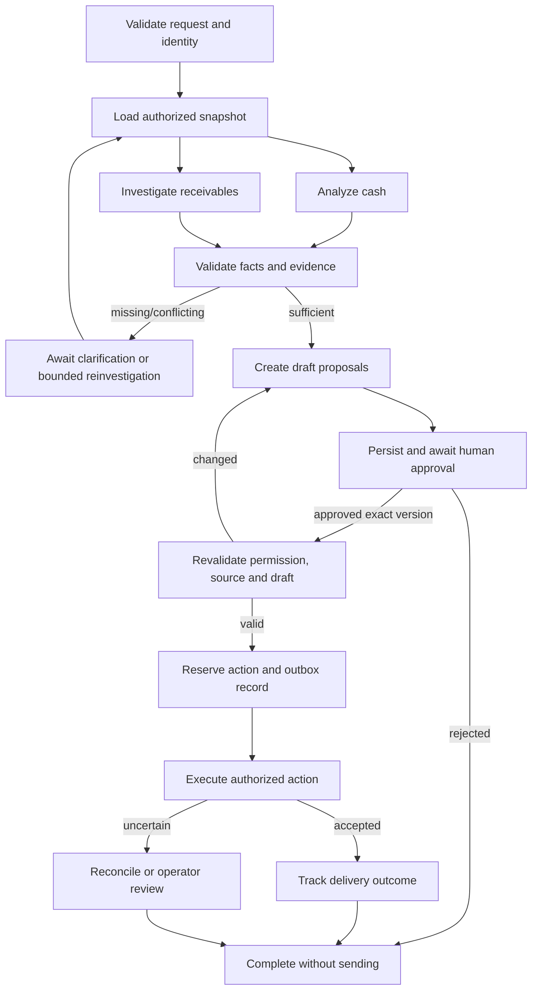

# Shared model foundation, agent harness, and execution loops

Status: **partially implemented**. The initialization foundation now includes typed contracts/settings, provider ABC with fixture/OpenAI adapters, `BaseAgent`, packaged YAML prompts, `ConnectionAgent`, CLI, and offline tests. The explicitly requested live probe passed on 2026-09-27. Conversation history (Pydantic AI messages per tenant-owned thread), approved preference memory, `BaseTool` with validation and deadlines, and per-role MCP toolsets are implemented and tested, but no business agent uses them yet. The full business-agent runtime described below remains planned for phases 01–12 of [the implementation plan](implementation_plan.md).

MCP is the required agent-to-tool interface, introduced in milestone 06A. [The MCP/A2A plan](mcp_a2a_plan.md) defines finance, evidence, and collections servers, database access, authentication, version compatibility, and the conditional A2A decision at 10A.

Implement and demonstrate this runtime locally. AWS hosting and its credentials/services are not dependencies. Model hosting is a separate profile choice: fake models for deterministic offline tests, then a qualified local model or explicitly selected hosted API for quality evaluation. Do not confuse a live model call with enabling real external business actions.

The current probe uses one OpenAI Responses call through the shared provider contract. It has no business data, tools, or autonomous loop. Pydantic AI will own the later business-agent tool loop; extend the existing initialization foundation rather than creating competing model settings or provider initialization. Prompt assets use `backend/app/prompts/<agent>/v<N>.yaml`, loaded safely and validated by schema/version.

## 1. What “a base model for all LLM calls” means here

We need three distinct foundations:

| Foundation | Purpose | Example |
| --- | --- | --- |
| Pydantic data contracts | Validate application inputs/outputs and configuration | `ModelProfile`, `FinancialAnalysis`, `CollectionDraft` |
| Shared model configuration | Resolve which provider/model/settings an agent uses | Agent role `analyst` resolves to profile `reasoning_primary` |
| Shared execution harness | Apply authorization context, budgets, tools, telemetry, and error behavior to every invocation | `AgentRunner.run(spec, input, context, budget)` |

One central configuration does not require every task to use the same model. Start with one qualified chat profile to reduce variables; evaluate a different profile for drafting only if the quality/cost evidence supports it. Embeddings have their own centrally configured profile and dimension. Do not train a new foundation model or invent a second agent framework for this project.

Pydantic AI supplies typed agents, dependency injection, and tool integration. We will use that runtime inside application-owned boundaries, rather than writing our own provider-specific tool-call parser. [Pydantic AI agent documentation](https://ai.pydantic.dev/agents/)

## 2. Runtime responsibilities and files

| File | Responsibility | Key acceptance condition |
| --- | --- | --- |
| `core/settings.py` | Validated configuration and environment modes | Real external actions cannot start with fixture identity; local modes require only their selected dependencies |
| `agents/base.py` | Initial typed, injected single-call template; extend under the runner later | No provider construction in agent files |
| `agents/connection.py` | No-tool diagnostic using `connection/v1.yaml` | A live gate passes only after actual inference and marker validation |
| `llm/contracts.py`, `llm/provider.py`, `llm/providers.py`, `llm/prompts.py` | Existing initialization contracts, ABC, adapters, and YAML loader | Offline and live paths share boundaries; failures never fall back silently |
| `llm/profiles.py` | Provider/model/capability profile schemas | Invalid combinations fail before the first API request |
| `llm/registry.py` | Construct and cache provider clients/model adapters | Agent files contain no independent provider initialization |
| `llm/runner.py` | Execute a configured agent under shared policies | All model requests, including repairs/fallbacks, are metered and observable |
| `llm/budgets.py` | Request/tool/token/deadline reservations shared by graph branches | Parallel branches cannot each spend the full parent budget |
| `llm/usage.py` | Normalize usage and price-version accounting | Unknown price/usage is labeled unknown, never zero |
| `llm/redaction.py` | Scrub credentials and configured sensitive fields | Prompts, tools, and exporters cannot log access tokens |
| `agents/dependencies.py` | Approved MCP toolsets, request identity/delegation, clock, typed task findings | Agents receive no raw database session or provider credentials |
| `agents/outputs.py` | Structured agent results and evidence requirements | Financial claims are checked against tool results |
| `tools/registry.py` | Agent-specific permitted tools and MCP server/catalog bindings | A drafting agent cannot acquire sending or cross-tenant capabilities |
| `mcp/client_manager.py` | Approved server connections, request-specific authentication, transport lifetime | One user's credentials or tenant context cannot leak into another invocation |
| `mcp/servers/` | Thin protocol adapters over authorized business services | Server checks still hold when client-side allowlists are bypassed |
| `workflows/state.py` | Typed state passed between graph nodes | State contains versioned references and bounded results |

A lint/import rule can prohibit direct provider SDK use outside approved adapter modules. Integration tests must also prove that a new agent receives the shared settings, instrumentation, and limits; source layout alone is not enforcement.

Apply the same rule to business access: agent modules do not import database repositories or instantiate their own MCP connections. The host client manager owns connection configuration, and servers own database credentials. Direct domain/service calls remain useful for isolated tests and trusted non-agent infrastructure operations.

## 3. Proposed model configuration

This sketch illustrates the fields to validate. `configured-chat-model` is a placeholder, not a real model identifier. Paid business evaluation requires real candidates and a budget. The separate connection profile in the existing `config/models.toml` is limited to the explicitly invoked diagnostic request.

```toml
[profiles.reasoning_primary]
provider = "configured-provider"
model_id = "configured-chat-model"
timeout_seconds = 20
max_output_tokens = 1500
transport_attempts = 2
structured_output_required = true
tool_calling_required = true

[profiles.fake]
provider = "fixture"
model_id = "scripted-agent-v1"
timeout_seconds = 2
max_output_tokens = 1500
transport_attempts = 1

[roles]
baseline = "reasoning_primary"
analyst = "reasoning_primary"
investigator = "reasoning_primary"
collections = "reasoning_primary"

[limits.agent]
model_requests = 6
tool_calls = 12
output_repair_attempts = 1

[limits.workflow]
model_requests = 18
tool_calls = 30
node_transitions = 24
active_deadline_seconds = 90
parallel_agents = 2

[execution]
mode = "fixture"
external_sending_enabled = false
```

Local/test environment overrides map roles to `fake`. The values above are initial engineering hypotheses; benchmark and tune them before release. `transport_attempts = 2` means an initial attempt and at most one retry, not two extra retries. Provider-specific sampling/reasoning parameters are capability-validated and omitted if unsupported.

Use an additional versioned embedding profile with provider, model ID, dimension, batch limit, timeout, and index version. Use a pricing table with currency, effective date, and model/version keys for cost estimates; pricing is not hard-coded into an agent prompt.

## 4. Harness contract

The application-owned entry point should conceptually accept:

```text
AgentRunner.run(
    spec: AgentSpec,
    input: TypedTaskInput,
    context: AuthorizedExecutionContext,
    budget: SharedRunBudget
) -> AgentRunResult[TypedOutput]
```

`AgentSpec` identifies role, prompt version/hash, output schema version, approved MCP server/tool catalog hashes, allowed toolset, model profile, repair policy, and validation functions. `AuthorizedExecutionContext` contains tenant/actor/run IDs, current capabilities, source-snapshot references, an injected clock, cancellation state, and request-specific delegated MCP tool dependencies. Neither structure can be constructed from unvalidated user/model JSON.

`AgentRunResult` includes typed output or a normalized failure, termination reason, tool/evidence references, usage, elapsed time, and versions. It does not expose hidden reasoning. A user-facing explanation is a deliberate output supported by evidence, not a dump of internal model deliberation.

The runner's ordered steps are:

1. Check the run is active and the actor still has the capability required for this stage.
2. Resolve the agent specification and model profile; reject unknown or incompatible values.
3. Load the exact prompt version and construct approved MCP toolsets. Validate server identity, compatible protocol/catalog versions, and request-specific credentials/delegation; the server independently validates each call.
4. Build a bounded context containing relevant records/evidence, approved preferences, and explicit data freshness.
5. Reserve request/token capacity against the shared budget before dispatching a provider request.
6. Execute through Pydantic AI, instrumenting every MCP tool attempt, server outcome, and model request, including retries and repairs. Decode/validate structured MCP results before putting them into model context.
7. Validate the result schema and business claims; permit at most the configured bounded repair.
8. Record usage and settle reservations. Persist the typed result and evidence/version references at the workflow boundary.
9. Return a normalized result or failure without silently claiming completion after budget/error termination.

A graph node retry must consult the persisted result/run ledger before repeating work. There is still a crash window after a provider completes but before its result is durably stored; record that uncertainty and account conservatively instead of promising perfectly deterministic replay of live model calls.

## 5. Build each specialist in the same order

Use this checklist for the baseline agent and then for each specialist:

1. Write one sentence defining the business responsibility and a list of decisions the agent may make.
2. Define the input/output schemas, incomplete-result status, and evidence requirements.
3. Select a model profile through the registry; specify capability needs without embedding provider credentials.
4. Define the minimal dependencies and allowed tools from approved MCP servers; include server/catalog versions and reject unexpected discovered tools.
5. Write a versioned prompt covering task, tool use, evidence treatment, uncertainty, and termination.
6. Define deterministic post-validation: numeric agreement, known invoice IDs, citation ownership, allowed proposed actions.
7. Write fake-model interaction scripts for a successful path and representative malformed/unauthorized/looping paths.
8. Connect the agent to the shared runner; prohibit direct external sending.
9. Run the applicable golden cases and inspect traces/tool events.
10. Evaluate selected real-model behavior under a controlled budget; record the result and version changes.

| Specialist | Inputs | Typed output | Permitted tools |
| --- | --- | --- | --- |
| Cash-flow analyst | Question, horizon, authorized source snapshot, assumptions | Forecast reference, risk dates, scenario references, supported explanation, missing inputs | Cash position, financial projection, relevant invoice queries |
| Receivables investigator | Candidate invoices, snapshot versions, permitted policies | Findings per invoice, dispute/commitment status, evidence IDs, unresolved conflicts | Invoice lookup, collection eligibility, evidence search/excerpts |
| Collections assistant | Validated findings, permitted contacts, approved style preferences | Draft proposals, source IDs, reason summary, explicit review requirement | Approved findings/evidence lookup, preferences, trusted contact lookup, idempotent internal draft storage |

All specialists may ask for clarification when their task cannot be completed from available evidence. The graph maps this to a controlled awaiting-input state and a bounded resume path. An agent cannot invent a payment promise to complete its schema.

The permitted tools above are served through Finance, Evidence, or Collections MCP as described in the server catalog. Until Collections MCP is activated in phase 12, agents return typed draft proposals without invoking unimplemented preference/draft persistence tools. LangGraph continues to invoke the three internal specialists directly; A2A is reserved for a separately owned review task if milestone 10A is selected.

## 6. Tool contracts and authorization

Each tool definition needs:

| Field | Example |
| --- | --- |
| Stable name and version | `get_invoice:v1` |
| Protocol binding | Finance MCP server identity, compatible revision, catalog/schema hash |
| Typed arguments | Invoice ID; no actor/role/tenant override |
| Required capability | `read` |
| Result schema | Invoice snapshot with cents, source versions, freshness |
| Side-effect classification | Read-only, idempotent internal write, or external action |
| Allowed agents | Analyst/investigator |
| Execution policy | Timeout, result limit, retries, cancellation checks |
| Observability | Attempt, authorization decision, result/error, duration |
| Failure semantics | Not found vs inaccessible as appropriate; stale; unavailable |

MCP server handlers use parameterized queries and repository methods. Do not offer arbitrary SQL, arbitrary HTTP URLs, shell execution, or token access to these business agents. At this scope, defined tools cover the actual work.

Validate an invoice ID against the tenant reconstructed from verified server-side identity/delegation before fetching it. Record both denied attempts and permitted execution. Client allowlists are defense in depth; the MCP server must deny an unauthorized direct caller too. Domain services remain the authority when a policy document and a prompt disagree. Retrieved instructions and discovered tool descriptions never modify the approved tool registry.

Internal draft creation needs idempotency too: the same run/node/invoice/draft-version intent should not produce a new review item on every replay. Sending is deliberately absent from agent toolsets; only the execution service can use the sender adapter.

For MCP writes, preserve an application operation key across retries; a transport request ID is not sufficient. If a response is lost after draft commit, retrieve/reconcile the existing result before attempting a new logical operation. Do not fall back to direct SQL or a different server with broader permissions when MCP authentication or connectivity fails.

## 7. The inner model/tool loop

Pydantic AI owns the mechanics; our harness supplies limits and checks.

```text
Check cancellation/deadline/shared budget
  -> request model response
  -> if tool requests:
       validate schema, allowlist, current capability, arguments
       reserve tool budget and call the approved MCP server
       require independent server authorization and typed result validation
       add bounded tool results as data
       record progress fingerprint
       continue only if budget/deadline/progress rules allow
  -> if final structured output:
       validate schema and business evidence
       repair once if permitted and useful
       otherwise return completed, incomplete, or failed
```

Termination conditions include successful validated output, needed human input, denied required access, missing indispensable evidence, cancellation, exceeded requests/tokens/time, repeated no-progress calls, exhausted repair, or provider unavailability.

Detect no progress with a fingerprint of tool name, normalized arguments, source version, and result. Repetition against unchanged records should consume a small explicit repeat allowance, not loop indefinitely. Legitimate refreshes after a state/version change are a different operation.

Pydantic AI exposes usage-limit facilities; their exact accounting must be verified against the pinned version. Application budgets additionally include cross-agent work, external embedding/reranking calls, and resumed runs. [Usage API](https://ai.pydantic.dev/api/usage/)

## 8. The outer workflow loop

The workflow state should contain:

- Identity/ownership: run, actor, tenant, thread, and request IDs.
- Request: objective, horizon, approved options, and input version.
- Provenance: data snapshots, policy/prompt/model/graph/index versions.
- Typed findings: forecast, evidence, eligibility, contradictions, and draft references.
- Control: stage, attempts, transition count, cancellation, remaining shared budget.
- Review: pending questions, draft versions, approval references, expiry.
- Execution: action/outbox/provider-reference IDs and delivery status.

Do not serialize live database sessions, SDK clients, credentials, or unlimited transcripts into graph state.



Every back edge has a counter and a termination outcome. Do not automatically create an unlimited series of redrafts if the source keeps changing; stop and explain that human review is required.

Use distinct run states: `queued`, `running`, `awaiting_input`, `awaiting_approval`, `completed`, `cancelled`, `failed`. Track action states separately, including `reserved`, `dispatching`, `provider_accepted`, `delivered`, `failed`, and `delivery_unknown`. A completed analysis may coexist with an action needing operator attention; the UI must not label an uncertain send as delivered.

The active execution deadline excludes time spent waiting for human review. Review waits have their own expiry, and lifetime budget counters survive resumption. Reauthorization is mandatory after a long wait; a stale login or revoked role cannot be revived by replaying a checkpoint.

## 9. Retry ownership and failure recovery

| Failure | Owner | Allowed response |
| --- | --- | --- |
| Transient model transport failure | Model adapter/runner | Bounded jittered retry within the same shared budget |
| Invalid structured model output | Agent runner | One bounded repair with a concise validation error |
| Tool input validation failure | Tool/agent boundary | Return typed feedback; count the attempt; stop repetitive invalid calls |
| MCP transport timeout/disconnect | Client manager plus tool handler policy | Retry only within the shared budget; reconcile uncertain writes using the application operation key |
| MCP auth, protocol, or catalog mismatch | Client/server boundary | Deny or mark incompatible; never broaden permissions or silently switch to direct DB access |
| Stale data | Workflow/service | Refresh through an authorized integration or stop the action |
| Revoked QuickBooks credentials | Integration service | Mark reconnection required; no endless refresh loop |
| Worker crash before checkpoint | Worker/workflow recovery | Reclaim lease, inspect state, resume from a valid boundary |
| Duplicate queue/webhook delivery | Run/event handlers | Deduplicate by stable persisted identities |
| Sending timeout after submission | Action service | Mark delivery unknown; reconcile or escalate |

Persist transition guards and use database uniqueness/compare-and-set operations. A LangGraph checkpoint alone is not an exactly-once external-action mechanism. Place side effects after approval in isolated nodes and protect reexecution with an action ledger/outbox.

Maintain separate run-level cancellation and per-call timeouts. Cancellation cannot retract an email already accepted by a provider or guarantee that a remote model stops billing immediately; reflect the observed state accurately.

## 10. Budget and context controls

Use atomic reservations for concurrent branches and persist counters at resume boundaries. Per-agent limits sit inside the workflow limit; retries, fallback calls, output repair, embeddings, and rerankers contribute to the appropriate aggregate usage. Queue redelivery must not reset the budget.

Count MCP retries as attempts within the existing tool/deadline budget. Account for any evidence-server embedding/reranking use through versioned usage events; moving work behind MCP must not hide it from cost/latency reports. Conditional A2A work gets a delegated task budget and bounded polling; unavailable remote metering is explicitly marked unknown.

Request counts, tool counts, and configured output limits are enforceable application controls. Dollar budgets are estimates dependent on provider pricing and reported usage; reserve conservatively and fail closed on unpriced profiles when a cost cap is required. Report uncertainty rather than presenting estimated spend as a guaranteed provider invoice ceiling.

Context preparation should prefer the requested invoice, relevant excerpts, fresh tool results, and approved preferences. Preserve source IDs and uncertainty while trimming low-priority history. If necessary context cannot fit, return an incomplete result or request a narrower task; do not silently omit a dispute or approval constraint.

Cache only when ownership and staleness semantics are clear. Key cached retrieval by tenant, ACL/policy version, query/filter, and corpus/index version. Avoid a shared mutable client or response cache carrying one user's session or financial answer into another user's request.

## 11. Observability from the first invocation

Every trace should let an operator answer: who initiated the run, which records were accessed, what evidence supported a result, which version ran, why execution stopped, who approved which content, and what the external provider acknowledged.

Record structured events with correlation IDs, role, stage, allowed tool, policy decision, latency, usage, error class, and evidence/version references. Store approved content and business audit events in access-controlled audit storage; export redacted operational telemetry. Avoid high-cardinality tenant/customer identifiers as metric labels; use trace links for diagnosis.

For MCP include client/server spans, server identity, protocol/catalog versions, delegated run identity, and repository/retrieval outcome. Credentials are redacted and trace metadata is never used for authorization. If A2A is enabled, correlate local run, remote task/context, and returned artifact IDs while retaining local validation and approval authority.

A successful demonstration of the harness includes a valid response, a denied tool call, a request-limit stop, a no-progress stop, malformed output, cancellation, restart after checkpoint, and an uncertain external action. Each should produce a clear terminal or waiting state and an inspectable report.
