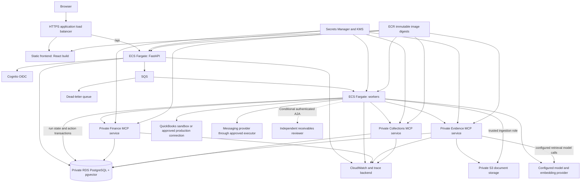

# Local Docker delivery, monitoring, and optional AWS plan

Status: proposed work for phases 13–19 of [the implementation plan](implementation_plan.md). **The complete local system is the required deliverable. AWS is a retained optional future plan, not part of current execution or acceptance.** Environment templates, `.dockerignore`, and a first Compose slice exist: `docker/Dockerfile.api`, `docker/Dockerfile.ui`, `docker/nginx.conf`, and `docker/compose.yaml` run the API and the React UI, with no secrets passed to either. The worker, database, MCP, identity, and telemetry services, real credentials, AWS resources, deployment pipeline, and alerts have not been created. Operational events are introduced earlier, when the application foundation is implemented.

Required MCP server/client infrastructure starts locally in milestone 06A. A2A is conditional on milestone 10A and can use a separate local process/container. See [the MCP/A2A plan](mcp_a2a_plan.md) for server catalogs, transports, protocol compatibility, and delegation authority.

## Current local scope and future service mapping

| Capability | Required local implementation | Optional future AWS mapping |
| --- | --- | --- |
| Application and MCP services | Local processes, then Docker Compose | ECS Fargate |
| Database/vector search | PostgreSQL with pgvector in a local container | RDS PostgreSQL/pgvector |
| Authentication | Local OIDC provider/test issuer and server-side sessions; fixture identity for tests | Qualified Cognito integration |
| Job queue | Durable PostgreSQL-backed queue, leases, retries, local dead-letter state | SQS and its separately tested semantics |
| Documents | Local files/volumes behind a storage interface | S3 |
| Secrets/configuration | Project-root `.env` for actual developer keys/static secrets; versionable empty-secret `.env.example`; isolated test keys | Secrets Manager/KMS |
| Observability | Structured local logs, local collector/viewer, local dashboards and test alerts | CloudWatch and selected AWS trace export |
| Messaging | Simulated sender or local test inbox | Optional approved external provider |
| Models/embeddings | Fake adapters for offline tests; configurable real local models or selected hosted APIs for quality evaluation | Model hosting/provider choice remains independent of application hosting |
| Recovery | Local worker restart, queue replay, PostgreSQL backup/restore, image/config rollback | Managed-service recovery and availability drills |

No AWS emulator or cloud account is required. Local adapters implement the application's contracts; they do not claim to reproduce every behavior of a future managed service. Test those differences if the AWS track is later selected. Downloading dependencies/images and optional hosted-model calls are distinct from deploying the application to a cloud.

## 1. Deployment units and dependency boundaries

Build one Python package (`backend/`) and one frontend bundle (`frontend/`), and deploy these roles independently:

| Unit | Responsibilities | Scaling signal |
| --- | --- | --- |
| FastAPI | Authentication callbacks, sessions, authorized read APIs, run/approval submission, webhook receipt | Request load, latency, connection capacity |
| Worker | Agent graphs, run resumption, outbox dispatch, synchronization/reconciliation jobs | Queue age/depth, run duration, provider quota, DB capacity |
| React frontend | Business-owner/operator UI: built static assets from `frontend/`, served same-origin with the API | Request rate and asset bandwidth; no server-side session state |
| Finance MCP | Authorized financial reads and deterministic projection tools | Tool latency/concurrency and database read capacity |
| Evidence MCP | Authorized retrieval/excerpts/policies over pgvector/documents | Retrieval latency, query load, configured embedding/reranking quota |
| Collections MCP | Approved preference reads and limited internal draft persistence | Tool load, draft-write contention; no sending capability |
| A2A reviewer, conditional | Independently deployed dispute-review tasks/artifacts | Remote task age/concurrency and its own service limits |
| PostgreSQL | Business records, preferences, run/action state, checkpoints, vectors | Connections, CPU/I/O, query latency, storage |

Worker entry points may have separate queue-consumer, outbox-publisher, and periodic-sync modes. They use the same application package but can have different IAM roles and autoscaling limits. The three internal agents remain in-process workflow components. MCP servers are separate processes/services with their own permissions, reusing one server image and explicit finance/evidence/collections entry points. A2A adds a separate reviewer only if selected.

Choose service boundaries based on operational ownership; do not create a network service for each agent or tool just to demonstrate distributed systems.

## 2. Local Docker implementation sequence

1. Resolve the Python/dependency lock and verify normal startup outside containers.
2. Write a multi-stage build strategy that installs only the required locked dependencies for each service.
3. Pin the base image and update it through reviewed dependency maintenance.
4. Copy application code and necessary versioned prompts/config; exclude `.env`, credentials, developer caches, Git metadata, and `data/evaluation/` answer keys.
5. Run as a non-root user. Use a writable temporary directory only where needed and avoid requiring a writable application directory.
6. Add service entry points, structured stdout/stderr logs, and clean signal handling.
7. Define health checks: process liveness separately from readiness to serve/consume work. Liveness must not restart every task when a model provider is temporarily down.
8. Add Compose services for PostgreSQL/pgvector, API, worker, UI, local identity, local telemetry, and finance/evidence/collections MCP. Use named database/document volumes, a durable local job queue, and real inter-container Streamable HTTP tool traffic. Activate collections only after its implementation milestone.
9. Use fixture connectors and a fake sender by default. Mount only intended business fixture files for importing; do not give the running agent access to golden answers. Read the root `.env` explicitly and pass each service only its required environment variables at runtime.
10. Keep migrations and seed import as explicit one-shot commands. Startup dependency ordering alone does not prove database readiness.
11. Configure a same-origin local reverse proxy that serves the built frontend and routes `/api` to FastAPI when testing browser authentication. The Vite dev-server proxy is the simpler fixture mode that may precede the real login flow.
12. Document commands for build, start, logs, migrations, seed, stop, and restart. Destructive volume removal must be distinct from normal stop.
13. Run the $8,000 scenario, restart the worker while awaiting approval, reconnect the UI, and verify the run survives.
14. Verify application images contain no golden files, real keys, or unnecessary build tools; check container architecture compatibility with local hardware and the AWS task target.
15. Give each MCP server only its required configuration/database role; do not inherit the worker's entire environment. Test catalog discovery, transport readiness, request identity, cross-tenant denial, and server restart through the actual client.
16. Add an opt-in Compose profile for the separate A2A reviewer if 10A is selected. Normal startup must work when that profile is disabled.

**Acceptance:** a clean checkout can run local login, finance/RAG/MCP, agent workflows, approvals, simulated delivery, and evaluation. Restarting services does not lose persistent state; local backup/restore and telemetry work. Startup and offline checks pass with AWS configuration absent. Quality reports distinguish fake-model tests from real-model evaluations.

The launch command, run from `cashflow-copilot/`, works today for the API and UI slice:

```bash
docker compose -f docker/compose.yaml up --build
```

Add `--env-file .env` when the first service needs a value from `.env`; the current services interpolate nothing.

`--env-file` supplies values for Compose interpolation; it does not automatically inject every value into every container. Define explicit per-service `environment` mappings so, for example, the UI does not receive model-provider keys and a Finance MCP process does not receive a migration-role password. Do not mount the entire `.env` into every service, use secrets as build arguments, or share output from commands that print the fully resolved configuration. [Docker interpolation](https://docs.docker.com/compose/how-tos/environment-variables/variable-interpolation/), [container environment configuration](https://docs.docker.com/compose/how-tos/environment-variables/set-environment-variables/)

## 3. Continuous integration and artifact provenance

First expose every check as a local command; hosted CI is optional automation of those commands, not a prerequisite for local completion. This project currently belongs to a parent Git repository. If CI is configured, put definitions in that repository's root `.github/workflows/`, with path filters and `working-directory: cashflow-copilot`, or move the project into a dedicated repository as a separate decision. Do not create a misleading nested workflow directory.

The pipeline should run:

1. Lock-file installation on the chosen Python runtime.
2. Formatting/lint/type checks.
3. Financial/domain tests and fixture integrity validation.
4. PostgreSQL-backed repository/migration/isolation tests.
5. Offline tool, workflow, approval, and security scenarios.
6. Image builds with dependency/image checks and a software bill of materials where supported.
7. Image smoke tests and required entry-point/readiness checks.
8. Evaluation artifact generation with code/config/dataset/prompt/model provenance.
9. MCP server/client protocol and schema compatibility, stdio/HTTP smoke tests, server-side authorization tests, and draft retry/reconciliation tests.
10. Conditional A2A card/task/artifact contract and authorization tests for any enabled remote-review feature.

Separate budgeted live-model evaluations from ordinary offline CI. Give trusted evaluation jobs only the necessary secrets; do not expose them to untrusted fork code. Do not embed evaluation artifacts containing sensitive traces into deployable images.

Build local release images once and record immutable digests with migration, graph/schema, prompt/config, and evaluation versions. If hosted environments are selected later, promote those same qualified digests through staging and production. Local acceptance does not require pushing to a remote registry or activating a hosted runner.

## 4. Optional future AWS architecture

This section and section 5 are future design references. Do not provision these resources or require these services to complete the local project. Shared operational principles in later sections are exercised locally first; any AWS-specific checks are conditional.



The API-to-queue edge represents the logical submission path. Durable run creation and an outbox record occur together in PostgreSQL; a publisher dispatches the queue message and tolerates duplicate dispatch. Do not use an unprotected dual write to a database and SQS and assume both will succeed.

Fargate executes container tasks without requiring us to manage EC2 servers. It still requires explicit networking, task resources, IAM, and scaling decisions. [AWS Fargate documentation](https://docs.aws.amazon.com/AmazonECS/latest/developerguide/AWS_Fargate.html)

## 5. Optional future AWS provisioning order

1. **Environment contract:** select AWS account(s), region, domain, tags, deployment principal, budget owner, and staging/production isolation.
2. **Terraform state:** establish restricted remote state, locking appropriate to the chosen backend/version, encryption, and recovery. Keep secret values out of committed variables and minimize sensitive state contents.
3. **Network:** VPC, public load-balancer subnets, private application/database subnets, routing, security groups, and controlled outbound access to external providers.
4. **Service connectivity:** route browser `/api` calls from the frontend's origin to the API; restrict callers while still validating sessions at the API. Provide private TLS MCP endpoints through an internal load balancer or another explicitly qualified TLS routing setup; allow only approved callers and retain server authentication/authorization. Plan required VPC endpoints or NAT traffic and their cost.
5. **Encryption and secrets:** task-role permissions, KMS keys as needed, static secret references, document encryption, and secret rotation procedures.
6. **Database:** supported RDS PostgreSQL/pgvector version, restricted application and MCP server roles, backup retention, encryption, connection budget, and production availability choice. Reserve separate pools for finance reads, evidence access, draft writes, and internal run/action state.
7. **Storage:** private S3 buckets/prefixes, metadata ownership, lifecycle rules, versioning as appropriate, and authorized short-lived downloads.
8. **Queue:** SQS run/resume work queue, visibility policy, redrive/dead-letter configuration, retention, and alarms.
9. **Identity:** Cognito configuration, approved callback/logout URLs, server-side client configuration, and application membership provisioning.
10. **Compute/artifacts:** ECR repositories, ECS cluster/task definitions, execution/task IAM roles, logs, service health checks, CPU/memory limits. Include MCP server services and their resource-specific credentials/delegation validation; include a reviewer task service only if A2A is selected.
11. **Ingress:** certificate, HTTPS load balancer, host/path routing for UI/API/auth/callbacks, request/body limits, and appropriate WebSocket/timeouts.
12. **Telemetry:** log groups/retention, OTLP collector or supported trace exporter, dashboards, metric alarms, and operator routing.
13. **Pipeline:** CI federation to a narrow deployment role, environment-scoped deploy jobs, image promotion, and migration execution.
14. **Application rollout:** migration, service deployment, readiness, authenticated smoke, synthetic read-only scenario, approval with simulated sending.

For production, size redundancy and database availability against the selected SLO/RTO/RPO. A low-cost single-instance learning deployment should be labeled as such, rather than inheriting claims about highly available production operation.

## 6. Authentication, secrets, and tenant boundaries locally and later

Keep application login and QuickBooks connection authorization independent. The former identifies a person; the latter grants a specific connected company's data access to our integration.

The required local browser flow uses a local OIDC issuer, a backend callback, and an opaque application-session cookie under one local origin. Configure local TLS to exercise Secure-cookie behavior; any explicitly enabled loopback HTTP test mode must be rejected by a hosted production profile. The browser sends that cookie with same-origin `/api` requests; the React code never reads it, and the API checks the session and membership. Validate login, expiry, logout, and reverse-proxy routing locally. A later Cognito adapter must pass its own integration tests.

Set session cookies with Secure, HttpOnly, a deliberate SameSite policy, correct path/scope, expiry, and rotation. Protect state-changing requests against CSRF. Logout revokes the server session so already-open UI sessions cannot keep authorizing API calls. Do not put tokens in query parameters, `localStorage`, or any JavaScript-readable storage.

Locally, keep actual developer API keys, static client secrets, database-role passwords, and the local integration encryption key in `cashflow-copilot/.env`. Keep permissions owner-only (`0600` on macOS/Linux), and version only `.env.example` with empty secret values. The initial LLM settings loader uses secret-aware fields and redaction; extend it to infrastructure settings as those components are built; `.env` is excluded from Git and Docker contexts. Per-tenant rotating integration tokens later belong in encrypted, access-controlled integration storage with atomic updates/refresh coordination; do not rewrite a shared `.env` for every connected customer. Local simulators use fake credentials. Secrets Manager/KMS are optional future implementations, and model inputs never include provider credentials.

Check ownership for runs, checkpoint threads, chunks/documents, downloads, preferences, approvals, and exports. Worker service identities receive narrow tenant-bound job scopes; they do not inherit arbitrary authority from queue JSON. Validate the job's run-to-tenant mapping in trusted storage.

MCP adds a separate authentication boundary. Use local test-issuer resource-bound credentials and verified per-run actor/tenant delegation, with server-side permission checks on every request. A local network, future workload identity, or shared connection is insufficient to establish which customer's records a model may access. Do not pass browser cookies or QuickBooks tokens through to MCP. A future Cognito/issuer deployment needs a separate delegation compatibility test. Credential/session rotation must not mutate global client headers across users.

For the selected MCP revision, test protocol/capability negotiation, authorization discovery, Origin/Host requirements, request cancellation, proxy buffering/timeouts, and any supported stateful behavior. Do not configure connection/session routing from an older protocol example without verifying it against the pinned SDKs. A logical MCP session, where used, is not the owner of business workflow state.

If A2A is enabled, restrict peer identities/card endpoints, task and artifact reads, and minimum necessary evidence sharing. Start with polling; authenticate/validate callback destinations and payloads before enabling push delivery. Returned peer artifacts cannot authorize local sending. Unknown remote URLs must not be fetched simply because they appear in a message or artifact.

## 7. Queue processing and crash behavior

Implement and test durable local queue behavior with duplicate submissions, leases, restart, bounded retries, and dead-letter state. A future SQS adapter must also handle duplicate delivery; qualify it separately rather than assuming the local queue proves managed-service compatibility. [SQS at-least-once delivery](https://docs.aws.amazon.com/AWSSimpleQueueService/latest/SQSDeveloperGuide/standard-queues-at-least-once-delivery.html)

1. Persist each run and its dispatch intent atomically.
2. Publish local work items containing references, not secrets or the entire conversation; retain this contract for a future queue adapter.
3. Acquire a durable run lease/fencing token before execution.
4. Renew the local lease while active; stop work if ownership is lost. Map this to the managed queue's visibility behavior only in the optional AWS adapter.
5. Checkpoint safe workflow boundaries and persist action reservations independently of a process's memory.
6. Acknowledge only after the outcome/next durable state is recorded.
7. Bound retries by error class and move unrecoverable messages to the dead-letter queue with context.
8. On redrive, check whether the transition/action is already complete or uncertain before attempting it again.

Autoscaling should consider queue age and model/provider quotas, not only CPU. Per-tenant concurrency and fair scheduling prevent one tenant from occupying every worker or consuming another tenant's budget. Reserve database connections for API and operational work rather than allowing workers to exhaust the whole pool.

## 8. Monitoring and audit implementation

Define the event schema in the foundation phase and instrument every new component as it is added. Build local dashboards and local test alerts after enough real events exist to validate them. CloudWatch accounts/exporters and external alert delivery are optional future adapters, not requirements for observing the local system.

| Layer | Signals |
| --- | --- |
| API/UI | Request errors/latency, session failures, active sessions, denied operations |
| Workflow | Submitted/completed/failed/cancelled runs, active duration, approval wait, retries, graph stop reason |
| Model | Provider errors, request latency, requests/tokens, schema-repair rate, budget stops, estimated cost |
| Tools | Authorization denials, latency/errors, result sizes, freshness, repeated-call stops |
| MCP | Per-server/transport latency, protocol/catalog mismatch, auth/delegation failures, reconnects, malformed results, cancelled calls, duplicate-write reconciliation |
| A2A, if enabled | Remote task age/status, polling/timeouts, denied task/artifact access, peer version, cancellation/recovery, reported/unknown cost |
| Retrieval | Empty results, source/index age, citation failures, ingestion failures, index-version distribution |
| Integrations | Sync lag, token-refresh failures, throttling, webhook lag/deduplication, reconciliation differences |
| Actions | Pending approvals, invalidated drafts, reserved actions, provider acceptance, bounces/delivery unknown |
| Infrastructure | Queue age/dead-letter depth, worker saturation, DB connections/query latency, storage, task restarts |
| Quality | Offline/online reviewed errors, editing effort, inappropriate suggestions, drift by case/category |

Correlate logs and spans through request/run/action IDs across API, queue, worker, MCP client/server, database/retrieval, model calls, and external actions. Record prompt/tool/model/policy/data and protocol/catalog versions. Correlate remote task/artifact IDs if A2A is enabled. Use a supported OpenTelemetry collection/export path; verify instrumentation compatibility for the pinned libraries instead of assuming every nested call is traced automatically.

Keep redacted operational telemetry separate from business audit records. Audit the exact approved draft hash/version, approver, decision timestamp, policy, revalidation result, and provider result. Make audit events append-only to the application role and define retention/export permissions. Do not use customer names or invoice IDs as unbounded metric labels.

Initial alerts should cover sustained run failures, stale source data, growing queue age, dead-letter arrivals, repeated invalid credentials, delivery-unknown actions, unexpected access-denial spikes, and spend/resource budget anomalies. Every alert needs an owner, a runbook, and a test showing it can fire and resolve.

## 9. Candidate service objectives and measurement

Set actual service objectives after baseline/load measurements and customer requirements. For planning, measure:

- API acceptance latency separately from time until the first useful result.
- Active workflow p50/p95/p99 separately from time waiting for a human.
- Source freshness per connected system, with the fixture's 60-minute action rule as a versioned initial policy.
- Successful recovery after worker termination and duplicate message delivery.
- Per-run/tenant estimated model cost and infrastructure cost allocation.
- Time to identify and resolve an uncertain external action.
- Backup recovery point and measured restoration time.

For an initial local load experiment, try a declared concurrency such as 10 simultaneous analysis runs and publish machine/container resources, throughput, tail latency, any model-provider limits, and known cost. This is a test condition, not an asserted capacity or a promised SLO. Determine acceptance thresholds before using the test to accept the local build; repeat in a hosted environment only if that track is selected.

## 10. Release, rollback, and recovery sequence

1. Freeze a release candidate: source/image/config/prompt/model/graph/index versions and evaluated dataset.
2. Review migration compatibility and running checkpoint schemas. Use additive/expand-contract migrations where practical.
3. Start the local Compose candidate and run authentication, local import/sync, MCP discovery/calls/authorization, forecast, retrieval, approval, and simulated-send smoke tests. Include local A2A task/result recovery when enabled. A cloud staging run is a later optional repetition.
4. Run the required evaluation and resilience suite; inspect new quality/latency/cost regressions.
5. Restore a backup into an isolated database and verify critical records/relationships without sending external messages.
6. Exercise rollback to the previous image/config. Do not assume application rollback can undo destructive schema changes; define restore/forward-fix paths.
7. Complete the local demonstration with synthetic tenants and simulated actions. Only a later explicitly selected customer/production rollout introduces real cohorts, initially read-only and then reviewed/approved actions.
8. Monitor leading indicators and keep a sending kill switch independent of read-only analysis.
9. If thresholds fail, stop new actions, preserve audit/state, roll back or forward-fix according to the runbook, and reconcile uncertain provider outcomes.
10. Record actual deployment, recovery, and rollback times, along with any data/action limitations observed.

Do not replay messages, recreate actions, or regenerate state blindly after a database restore. Compare restored action records with external provider history and reconcile gaps before re-enabling dispatch.

## 11. Required operational runbooks

| Runbook | Concrete procedure to include |
| --- | --- |
| Model provider outage | Bound retries; show degraded status; use only a separately qualified fallback or stop; preserve budget/state |
| MCP server outage or catalog mismatch | Identify affected tools, stop incompatible calls, restore/roll back the server/catalog, reconcile uncertain writes; never broaden access through direct-DB fallback |
| A2A peer failure, if enabled | Retrieve existing task state, bound polling, cancel/escalate, preserve evidence/ownership and local approval boundaries |
| QuickBooks reconnection | Identify tenant connection, stop dependent actions, reconnect, reconcile missed updates, clear stale status |
| Stale financial data | Explain affected inputs, refresh authoritative records, invalidate affected drafts, request fresh approval |
| Delivery unknown | Locate action/provider IDs, check provider status, document operator decision, avoid blind duplicate sending |
| Worker/queue failure | Inspect lease/checkpoint, restore capacity, redrive safely, verify idempotent outcomes |
| Database incident | Disable writes/actions as required, restore/fail over, validate state and external action reconciliation |
| Tenant-access incident | Revoke affected sessions, isolate evidence/logs, trace access paths, fix boundaries and test before resuming |
| Cost spike | Inspect token/tool loops and queue retries, apply existing quotas, disable problematic profile/workflow, evaluate fix |
| Document deletion/reindex | Remove authorized content from source/index/cache/memory under policy; rebuild versioned index and verify retrieval |
| Release rollback | Select previous image/config, check schema/checkpoint compatibility, smoke test, reconcile pending actions |

Each runbook identifies an operator role, required evidence, reversible first actions, escalation contact, and conditions for resuming service. These are implementation deliverables, not messages to be sent to anyone during planning.

## 12. Cost and FDE handoff

Estimate costs by environment and workload before provisioning: always-on application and MCP containers/database/load balancers, NAT/endpoints, document/vector storage, logs/traces, queue traffic, embedding ingestion, model calls, and backups; add remote A2A task costs only if selected. Include cleanup instructions for temporary learning environments while preserving intentionally retained data. No numeric AWS price estimate is asserted here.

The current FDE handoff includes the local architecture, setup commands, integration capability matrix, evaluation reports, limits, measured local recovery results, dashboards, runbooks, and a reproducible demonstration. Include AWS architecture/cost planning as an optional appendix. Real customer outcomes and hosted-service reliability remain future measurements; local acceptance does not depend on claiming them.
