# Golden datasets, evaluation harnesses, and improvement loops

Status: implementation design. The existing 18 cases and financial oracle are available; an agent evaluation runner, trained graders, production benchmarks, and measured quality results are **not** implemented yet. Read [the fixture guide](evaluation_guide.md) for the exact current scenarios and [the implementation plan](implementation_plan.md) for build dependencies.

The revised design includes required MCP boundary tests and conditional A2A interoperability tests. Their cases below are proposed additions to a new dataset release; the original 18-case snapshot remains unchanged. See [the protocol plan](mcp_a2a_plan.md).

**Current acceptance target is local execution.** Required tests, actual MCP transport checks, authentication flows, workflow recovery, local load tests, and reports run without AWS. Cloud staging, live QuickBooks/messaging qualification, and hosted CI are optional future/integration tracks. Real model-quality evaluation may use a local model or a selected hosted model API; fake-model correctness tests do not establish that quality.

## 1. Distinguish the harnesses

| Harness | Runs in | Responsibility |
| --- | --- | --- |
| Agent execution harness | Application workers and tests | Authorized dependencies, model/tool limits, context, validation, telemetry |
| Component test harness | Local tests/CI | Finance, repositories, auth, ingestion, adapters, approval/execution contracts |
| MCP transport/contract harness | Local processes/Compose; optional CI/cloud repetition | Real server/client calls, catalog compatibility, authorization, structured results, reconnect/write reconciliation |
| A2A interoperability harness, conditional | Separate local service/container first | Peer discovery/authentication, remote task lifecycle, artifacts, cancellation, recovery |
| Workflow evaluation harness | Local/CI/controlled evaluation jobs | Isolated realistic tasks, scenario events, agent/tool observations, grading |
| Load/resilience harness | Local; optional later cloud qualification | Concurrency, queue pressure, restarts, outages, recovery, resource limits |
| Human review workflow | Evaluation/pilot operations | Evidence support, usefulness, editing effort, rubric calibration |

The system under test must use the same application services, tools, prompts, and graph as the application. Dependency injection substitutes a clock/provider/sender where needed; do not construct a second toy workflow solely to pass evaluations. Full agent evaluations must traverse real local MCP client/server boundaries after 06A; direct service tests remain a separate layer and cannot establish protocol correctness.

## 2. What makes a golden example

A golden example contains a realistic task, authorized identity, known input state, relevant evidence, expected facts/actions, forbidden behavior, and a reviewable reason for those expectations. A polished reference paragraph alone is insufficient for an agent that can call tools and perform actions.

The existing data supplies:

- A fixed snapshot and hash manifest.
- Exact integer-cent financial outputs and daily forecast positions.
- Relevant document IDs for selected retrieval cases.
- Identity roles and a deliberately confusing second tenant.
- Eight scenario setups for failures and timing changes.
- Eighteen case prompts and expected checks.

Preserve this snapshot as version 1. Do not regenerate it with new values while leaving evaluation answers unchanged. New scenarios and data releases receive their own manifests and version identifiers.

## 3. Dataset development and split strategy

1. Inventory the existing cases and assign an owner/reviewer for each domain assumption.
2. Keep a small development set visible during prompt/tool iteration.
3. Build a broader regression set from reviewed fixes and representative tasks.
4. Author new holdout examples independently and restrict access during tuning.
5. Split by underlying company/scenario/document family where possible, not only by paraphrasing one prompt into another split.
6. Track dataset version, source permission, tenant/scenario family, category, difficulty, label reviewer, and amendment history.
7. Promote a production failure into a redacted regression only after review; do not automatically trust feedback or send sensitive traces into training material.
8. Replace holdouts after they are inspected or used to select changes.

The four current `holdout`-labeled examples are already described in project documentation. They illustrate split mechanics but should not be presented as unseen evidence of generalization. Create fresh holdouts before claiming that kind of result.

A useful next expansion is roughly 100–150 reviewed cases across finance, retrieval, authorization, tool use, workflows, adversarial content, and communication quality. This is a planning target, not a claim of statistical sufficiency. Add new business shapes rather than only changing names in the same four invoices.

## 4. Proposed typed case contract

Extend the existing JSONL case format through an explicit adapter/version, rather than changing its meaning silently.

```text
EvaluationCase:
  case_id, schema_version, dataset_version, split
  category, tags, scenario_family, reviewer
  tenant_id, user_id, as_of
  prompt, permitted_user_options
  fixture_snapshot_hash
  scenario_fixture, setup_actions, event_schedule
  relevant_document_ids
  expected_facts, expected_decisions
  forbidden_reads, forbidden_actions
  required_events, expected_final_state
  grader_versions, applicable_layers
```

`setup_actions` records an explicit test approval where needed; a prompt saying “approved” never grants it. `required_events` ensures the intended failure path was reached. For example, a stale-sync case must not pass merely because the implementation rejects every request before checking freshness.

Keep expectations only inside evaluator objects. Pass the workflow the prompt, authenticated context, and fixture-backed services. Use separate types such as `EvaluationCase` and `TaskRequest` so accidentally serializing the whole case into a prompt is easy to detect.

## 5. Build the runner step by step

1. **Case loader:** validate schema, resolve only approved local fixture paths, verify manifest hashes, and select split/categories.
2. **Environment factory:** create an isolated database schema/database and retrieval namespace per case or reset a transactionally isolated fixture environment.
3. **Clock and identity:** install frozen business time, a controlled elapsed-time clock where needed, and the intended authenticated principal.
4. **Scenario adapter:** implement the eight explicit scenario operations; update linked records together and preserve baseline files.
5. **Controlled boundaries:** install accounting, messaging, model, and embedding adapters appropriate to the evaluation mode. Start real MCP servers backed by the isolated data and test credential/delegation issuer. Add an independently running fake A2A peer only for selected A2A cases.
6. **Event recorder:** observe requested and authorized tool calls on both sides of MCP, returned records/chunks, model output, graph states, approval changes, and provider attempts. If enabled, capture remote A2A task/artifact events too.
7. **Run the real workflow:** use the production runner/tool services with a fresh run budget and isolated state.
8. **Advance scheduled events:** inject payment-after-draft, duplicate notifications, membership revocation, or a worker restart at the designated boundary.
9. **Inspect postconditions:** query final invoice, payment, bank, approval, action, and outbox state; do not grade only the final text.
10. **Grade:** run deterministic checks first, then calibrated quality review where applicable.
11. **Report:** preserve raw outcomes separately from grades, with redaction/access controls and full version metadata.
12. **Clean up:** close sessions, stop workers, and remove isolated state, retaining only permitted reports needed to reproduce failures.

Use explicit hooks/events to schedule races, not unreliable sleep durations. Cases must be order-independent and capable of running alone.

## 6. Evaluation modes

| Mode | Models/retrieval | Purpose | What it cannot prove |
| --- | --- | --- | --- |
| Offline deterministic | Scripted model; fixture connectors/sender; deterministic retrieval stand-in when appropriate | CI contracts, safety boundaries, error recovery, workflow state | Live model competence or embedding relevance |
| MCP protocol integration | Real stdio/Streamable HTTP client and servers with isolated databases and controlled credentials | Tool discovery, schemas, server-side access checks, result parity, retries/cancellation | Live model competence or production network behavior |
| A2A interoperability, conditional | Separate test peer and real selected protocol SDK | Card/peer checks, task lifecycle, artifact validation, duplicate/restart behavior | Trustworthiness or quality of an untested third-party specialist |
| Real retrieval | Selected embedding model/index, controlled query set, no external actions | Chunking, ranking, amendment coverage, citation mapping | Complete agent behavior |
| Live agent evaluation | Real selected chat model; real app tools over isolated synthetic records; fake sending | Quality, tool selection, structured outputs, cost, latency | Real-world customer representativeness |
| Local integration contract | Controlled provider fixtures and signed local test events | Adapter contracts, OAuth failure handling, mapping, pagination, event processing | Actual external provider compatibility |
| Local end-to-end | Compose identity/API/queue/workers/MCP/UI, synthetic tenants | Browser login, tool transport, review/approval, simulated delivery, restart/recovery | Managed-cloud availability or real customer representativeness |
| External sandbox, optional | Authorized real sandbox responses and webhooks | Provider-specific contract qualification | Production load or all provider edge cases |
| Cloud staging, optional | Future deployed AWS identity/API/queue/workers/UI | Hosted-network/session/managed-service recovery behavior | Guaranteed production reliability |

Scripted fake models should drive real tool calls and return controlled faults. They may contain expected response scripts for contract tests, but reports must label them as scripted. Never present their deterministic answer accuracy as evidence of LLM reasoning quality.

## 7. Grader inventory

| Grader | Inputs | Assertion or metric |
| --- | --- | --- |
| Financial oracle | Structured outputs and underlying records | Exact cents, dates, assumptions, no double-counting |
| Business decision | Eligibility/draft/action state | Correct dispute holds and next steps |
| Authorization | Attempted calls, executed calls, SQL/retrieval results | No unauthorized data returned or state changed |
| Approval integrity | Actor, capabilities, draft hash/version, policy, expiry | Only currently valid exact-content approval authorizes execution |
| Action count | Outbox/action/provider events | No unauthorized send, duplicate settlement, or blind resend |
| Retrieval | Returned document/chunk IDs versus reviewed relevance labels | Recall@k, ranking quality where graded labels exist, tenant purity |
| Citation existence | Output source IDs and recorded evidence | References exist, were accessible, and were actually obtained |
| Citation support | Claim-to-excerpt alignment | The excerpt supports the claim, not merely a valid citation ID |
| Uncertainty | Assumptions, commitments, explanation | Tentative promises remain tentative; missing inputs are disclosed |
| Draft usefulness | Human rubric plus evidence | Appropriate tone, accurate amount/recipient, actionable wording |
| Runtime limits | Model/tool usage, transitions, elapsed time | Correct stop on bounds, no-progress, cancellation |
| Recovery | Pre/post-crash state and audit events | Consistent state, valid resume, truthful unknown outcomes |
| MCP boundary | Client/server events, approved catalog, credentials, data reads/writes | Compatible schemas, server-enforced permissions, no cross-tenant exposure, no duplicate draft after retry |
| A2A delegation, conditional | Peer identity, task mapping, artifacts, local state | Authorized task/result access and no transfer of local approval authority |

Use model-based graders only for suitable semantic judgments, with fixed prompts/versions and calibration against human labels. Do not use them to overrule an exact-money failure or authorization violation. A high overall average cannot compensate for a critical failed invariant.

## 8. Map the current fixtures to implementation layers

| Cases | Minimum layers to test |
| --- | --- |
| 01, 03, 17: forecast, partial payment, hypothetical receipt | Domain services; tools; final structured workflow result |
| 02, 04, 05, 11, 16: eligibility, promises, amendment, missing evidence, dispute | Retrieval; policy services; investigator/drafting output |
| 06, 07, 18: tenant/role restrictions | API; repositories/RLS; tools; vectors; final output |
| 08, 09, 15: payment race, stale sync, edited approval | Approval service; graph pause/resume; action executor |
| 10: injected document instructions | Retrieval payload; model tool attempts; data mutations; sender attempts |
| 12: uncertain delivery | Sender adapter; action ledger; recovery/operator state |
| 13: revoked OAuth | Integration refresh; workflow error state; no false success |
| 14: duplicate webhook | Receiver/event deduplication; payment/invoice/bank transaction |

Some cases have a right behavior at a deterministic service boundary without needing an LLM. Run those tests there as well as through the full workflow when appropriate.

### Additional MCP cases to author

| Proposed case | Required assertion |
| --- | --- |
| `mcp_01` compatibility/discovery | Selected protocol revision works; unexpected schema/catalog changes are rejected before model exposure |
| `mcp_02` result equivalence | Forecast and invoice amounts match the direct-service oracle over stdio and Streamable HTTP |
| `mcp_03` server authorization | A direct client bypassing the host allowlist still cannot read Copper data with an Aurora grant |
| `mcp_04` credential boundaries | Expired/wrong-resource credentials, forged tenant metadata, and provider-token passthrough fail |
| `mcp_05` concurrent tenant calls | Reused clients/connections/database pools do not share identity or returned data |
| `mcp_06` network/response failure | Timeout, malformed structured content, and server failure are not treated as empty successful business results |
| `mcp_07` write outcome unknown | Retry after draft commit returns/reconciles the same operation rather than creating a duplicate draft |
| `mcp_08` discovered-content injection | Tool descriptions, resources, and results cannot add permissions or replace trusted instructions |
| `mcp_09` authorization revocation | The next request fails after membership/credential revocation, including on an already-open connection |
| `mcp_10` limits and cancellation | Remote retries, large results, and any server-side model use respect accounting/limits; cancellation does not falsely imply rollback |

Run privilege tests directly against server endpoints as well as through the host. Prove the intended branch was reached; a client rejecting all requests cannot pass a server-authorization test. Compare returned structured content and actual database state, not only the final answer.

### Conditional A2A cases to author

Test approved versus unapproved peers/cards, tenant/task ownership, submitting the same delegated operation twice, retrieving work after caller restart, input-required and failure states, bounded polling/cancellation, unsafe artifact URLs or wrong-tenant evidence, and a peer falsely claiming it has approved a reminder. Verify that all returned review findings still pass local validation and final approval checks.

Keep A2A disabled as a documented scope decision when 10A is deferred. Report those cases as not applicable by design, not passed. Once A2A is selected for a release, required unsupported/failing A2A cases block that release.

## 9. Add adversarial, property, and metamorphic checks

Add cases for wrong-tenant IDs supplied directly, changed roles during approval waits, stolen/expired run URLs, revoked document access, malicious invoice notes, oversized uploads, malformed tool results, and contradictory dates.

Useful invariant tests include:

- Renaming a customer does not change invoice balances or ownership.
- Reordering records does not change the forecast.
- Replaying an import or the same settlement event does not double-count cash.
- Increasing a scheduled bill by a known number of cents changes closing cash by exactly the negative of that amount.
- Settling a previously scheduled receipt before the snapshot increases starting cash and removes that future receipt, preserving the corresponding closing-cash projection when no other assumption changes.
- A tenant's financial result is unchanged by adding another tenant's records.
- A changed approved recipient/content never retains the old approval's validity.

Include data-size scaling separately from semantic evaluation: many rows exercise query/index/load behavior but do not automatically create diverse reasoning cases.

## 10. Trial execution and reproducibility

For live models, run repeated trials for representative cases and report both case-level and trial-level outcomes. Record the number of trials, sampling settings, model identity, dataset hash, prompts, tools, graph/policy/index versions, cost-table version, and machine/deployment conditions.

Identical fixture bytes and temperature settings do not guarantee identical hosted-model responses. Do not promise bit-for-bit replay of a live provider. Preserve enough sanitized evidence to reproduce the setup and investigate differences.

A run manifest should include:

```text
evaluation_run_id, timestamp, code_revision_or_source_hash
dataset_version, manifest_hash, split, case_ids, trial_count
model_provider_and_id, model_profile_hash, prompt_hashes
  tool_schema_versions, graph_version, policy_version, retrieval_index_version
  mcp_server_versions, protocol_revision, catalog_hashes, transport_mode
  a2a_enabled, peer_and_protocol_versions_if_enabled
environment_mode, infrastructure_version, configured_budgets
grader_versions, human_review_status
```

If no Git commit exists yet, record a source hash and explicitly identify an uncommitted working tree. Keep full case transcripts in access-controlled artifacts with retention limits; reports must not expose tokens or other tenants' data to unauthorized viewers.

## 11. Report format and release gates

Generate machine-readable JSON, per-case JSONL, and a concise Markdown/HTML report. Include pass/fail/unsupported/error separately, failure category, evidence/trace link, quality metrics, latency percentiles, cost distributions, and comparison to a named baseline.

Proposed local acceptance rules, extended by additional environment-specific gates only when a cloud/provider track is selected:

1. Exact financial assertions pass for every applicable deterministic case.
2. No unauthorized data disclosure/action in the required security suite.
3. Approval integrity and external-action recovery tests all pass.
4. Unsupported cases are explicitly excluded only with a documented scope decision; required unsupported cases block release.
5. Citation/usefulness thresholds are chosen with human review after measuring the baseline; publish numerators/denominators, not just a score.
6. Operational targets and known spend are measured in the stated local environment; candidate values are not represented as achieved results. Local measurements do not imply AWS capacity or availability.
7. Fresh holdout and local integration results accompany the local candidate, with no unexplained regression on critical categories. External provider and cloud qualification become additional gates only for a later candidate that enables those integrations.
8. Required MCP transport/security gates pass against the shipped server/client versions; selected A2A features pass their peer/task/artifact suite. In-process-only results cannot stand in for these checks.
9. The local system starts and passes offline tests with AWS credentials/settings absent. Deferred cloud/sandbox checks are reported as not selected, never passed and never counted as failures of the local-only scope.

For a small set, report raw failures and repeated-trial counts. Confidence intervals become useful as the independent case count grows; correlated paraphrases must not be treated as independent evidence. Zero observed violations in a suite is a release criterion, not proof that a system can never fail.

## 12. Improvement loop

```mermaid
flowchart LR
    Baseline[Freeze baseline and dataset] --> Run[Run controlled evaluation]
    Run --> Diagnose[Classify failures using traces and evidence]
    Diagnose --> Change[Change one component or documented hypothesis]
    Change --> Regression[Run focused and full regression checks]
    Regression --> Compare[Compare quality, cost, latency, safety]
    Compare --> Review[Human review and fresh holdout]
    Review --> Release[Version and release or reject]
    Release --> Feedback[Curate pilot feedback into new cases]
    Feedback --> Baseline
```



Start diagnosis at the failing boundary. Missing an amendment may require retrieval/index changes; a wrong forecast requires financial service fixes; an invented claim may require output validation or prompt/model changes. Adding another agent is not a universal repair.

Store hypotheses and comparison reports. Freeze the selected candidate before final holdout evaluation. Do not continually tune on the same holdout while continuing to call it unseen.

## 13. Local checks, optional CI, and operational cadence

Every required check is callable locally. A hosted CI runner may automate the same commands later; it is not a prerequisite for local acceptance or a reason to deploy AWS resources.

| Trigger | Required work |
| --- | --- |
| Domain/config/tool change | Relevant unit/contract tests and offline regression slice |
| Database/auth/approval change | PostgreSQL integration, isolation, and action-state tests |
| MCP SDK/server/catalog/auth change | Protocol compatibility, direct-client authorization, result parity, concurrency, and uncertain-write recovery |
| Selected A2A adapter/peer change | Task/artifact authorization, restart/duplicate/cancellation, and local approval-authority tests |
| Prompt/model/retrieval change | Offline checks plus controlled real-model/retrieval comparison |
| Local release candidate; optionally a pull request | Full required offline suite, Compose end-to-end checks, build, versioned report |
| Scheduled evaluation | Budgeted repeated live trials, drift/cost/error review |
| Optional cloud staging release | Additional cloud-authenticated smoke, end-to-end, migration/recovery checks |
| Local review failure; later an optional pilot | Triage, reproduce, fix, curate regression with permission/redaction |

Keep golden answer files out of runtime container images and production ingestion permissions. Evaluation jobs receive them; ordinary application workers do not. A planned evaluation CLI should expose case/split/trial/model-mode and spend limits explicitly and return a nonzero status for required failures.
