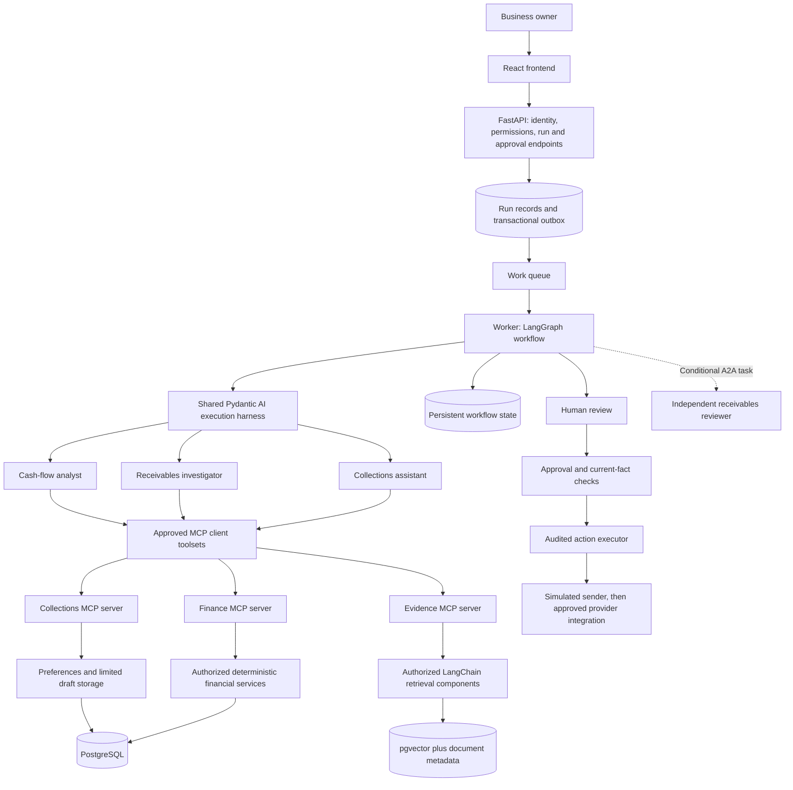

# Implementation plan: Cash-Flow and Collections Copilot

Status: **partially implemented**. Synthetic data and the initial LLM foundation run locally: typed settings/contracts, provider ABC, fixture/OpenAI adapters, shared `BaseAgent`, YAML prompt loader, `ConnectionAgent`, CLI, locked dependencies, and offline tests. The explicit live connection probe passed on 2026-09-27. Tested bases now also exist for phases 03, 06/06A, 08 and 11 (authentication, phase 04, is not started): a SQLite database through SQLAlchemy async Core (PostgreSQL by URL later), CSV import, embeddings (offline hashing and OpenAI), a vector store, ingestion and a retriever, preference and conversation memory, `BaseTool`, and a stdio finance MCP server with role allowlists; see the README's Foundations section. Each is a first slice; none of those phase gates is claimed. This is an initial subset of phases 01/05; a first Docker Compose slice runs the API and the React UI (phase 17 is not claimed). Business agents, full execution/evaluation harnesses, and the remaining Dockerfiles and Compose services remain proposed. The tree below is a destination, created incrementally.

**Current delivery scope: build and demonstrate the complete application locally first. AWS deployment is an optional future track, not a prerequisite or completion gate.** Local authentication, database/vector search, MCP servers, agents, workers, memory, approvals, evaluation, observability, and Docker must run without an AWS account. The required sequence is phases **00–17 plus 06A, then local handoff in 19**. Phase **18 is optional and deferred**. A2A remains conditional and, if selected, can be demonstrated with separate local processes/containers.

Local hosting and model inference are separate choices. Offline contract tests use fake models; meaningful model/retrieval quality evaluation uses a configured real local model or an explicitly selected hosted API. Neither choice requires deploying our application to AWS. Hosted-model calls and real QuickBooks/messaging connections are explicit integrations, never requirements for offline startup or deterministic tests.

Read this document first, then [the model and agent runtime design](agent_runtime_plan.md), [MCP servers and conditional A2A delegation](mcp_a2a_plan.md), [the evaluation harness plan](evaluation_harness_plan.md), and [the deployment and operations plan](deployment_plan.md). The existing [data dictionary](data_dictionary.md) and [fixture guide](evaluation_guide.md) describe the actual supplied data.

Protocol revision: MCP tool serving is required, with milestone **06A** before agent implementation. Milestone **10A** records the A2A decision and implements it only when an independently deployed specialist or an explicit interoperability exercise justifies it. The original phase numbers 00–19 remain stable; 18 is optional, 19 completes the local track, 06A is required, and 10A is conditional.

## 1. Start with the possible directory structure

Paths are relative to `cashflow-copilot/`. The project uses the workspace's standard `backend/` + `frontend/` layout (the same template as the workspace root's `backend/` and `frontend/`); `.env`, `data/`, `scripts/`, and `docs/` stay at the project root. The repository currently lives inside a larger workspace; create CI workflows at the actual Git repository root with this project's working directory, or promote this project to its own repository later. A nested `.github/workflows/` directory would not run in the current parent repository.

```text
cashflow-copilot/
  README.md
  .env.example                  # Variable names and harmless placeholders
  .env                          # Local actual values; ignored, never committed
  .gitignore
  .dockerignore
  Makefile                      # Discoverable local commands
  backend/                      # FastAPI service; the workspace template's layout
    pyproject.toml                 # Dependencies, tooling, package metadata
    uv.lock                       # Locked dependency resolution
    .python-version               # Proposed application runtime: Python 3.12
    requirements.txt            # Exported from uv.lock for the template's pip setup
    alembic.ini
    config/
      default.toml
      local.toml
      test.toml
      staging.toml                # Optional future hosted environment
      production.toml             # Optional future hosted environment
      models.toml                 # Agent roles -> provider/model profiles
      mcp.toml                    # Approved servers, transports, auth, tool catalogs
      a2a.toml                    # Conditional remote-agent delegation; disabled initially
      policies.toml               # Versioned application rules
      evaluation.toml
      telemetry.toml
    app/                        # Python package; uvicorn app.main:app
      bootstrap.py                # Build dependencies once per process
      cli.py
      core/
        settings.py
        clock.py
        identifiers.py
        errors.py
        context.py
      domain/
        money.py
        finance.py
        evidence.py
        actions.py
        events.py
        policies.py
      llm/
        contracts.py             # Implemented initial request/result/profile/prompt contracts
        provider.py              # Implemented ModelProvider ABC
        providers.py             # Implemented fixture/OpenAI diagnostic adapters
        prompts.py               # Implemented safe YAML loader
        profiles.py              # Later expanded business model profiles
        registry.py
        runner.py
        budgets.py
        usage.py
        redaction.py
      prompts/
        connection/v1.yaml       # Implemented initial diagnostic prompt
        baseline/v1.yaml
        analyst/v1.yaml
        investigator/v1.yaml
        collections/v1.yaml
      auth/
        identity.py
        sessions.py
        authorization.py
        oidc.py
        local_identity.py
        delegation.py             # Verified actor/tenant/run grants for remote tools
      db/
        engine.py
        models.py
        repositories/
        tenant_context.py
        unit_of_work.py
        import_fixtures.py
      services/
        forecasting.py
        receivables.py
        approvals.py
        execution.py
        synchronization.py
        run_service.py
      tools/
        contracts.py
        registry.py
        finance.py
        retrieval.py
        preferences.py
        drafts.py
      mcp/
        config.py
        client_manager.py
        toolsets.py
        catalog.py
        auth.py
        context.py
        errors.py
        resources.py
        servers/
          finance.py
          evidence.py
          collections.py
      a2a/                        # Create only if milestone 10A is selected
        config.py
        agent_card.py
        client.py
        server.py
        task_adapter.py
        authorization.py
        artifacts.py
      rag/
        ingestion.py
        chunking.py
        embeddings.py
        indexing.py
        retrieval.py
        citations.py
      agents/
        base.py                  # Implemented generic BaseAgent ABC with injected provider
        connection.py            # Implemented no-tool connection diagnostic
        dependencies.py
        outputs.py
        baseline.py
        analyst.py
        investigator.py
        collections.py
      workflows/
        state.py
        graph.py
        nodes.py
        routing.py
        checkpoints.py
        recovery.py
      memory/
        conversation.py
        preferences.py
        retention.py
      integrations/
        contracts.py
        quickbooks/
          oauth.py
          client.py
          mapping.py
          sync.py
          webhooks.py
        messaging/
          sender.py
          reconciliation.py
        fixtures/
          accounting.py
          sender.py
      main.py                    # Implemented: FastAPI app and lifespan (workspace template)
      database.py                # Implemented: engine dependency and SELECT 1 check
      dependencies.py
      schemas.py
      routers/
        health.py                # Implemented: {"status", "db"} as in the template
        diagnostics.py           # Implemented: fixture-only connection check
        auth.py
        runs.py
        approvals.py
        documents.py
        integrations.py
      workers/
        main.py
        queue.py
        leases.py
        outbox.py
      observability/
        events.py
        logging.py
        tracing.py
        metrics.py
        audit.py
      evaluation/
        schemas.py
        runner.py
        setup.py
        scenarios.py
        event_recorder.py
        graders/
        reporting.py
        compare.py
    migrations/versions/
    tests/
      unit/
      integration/
      contract/
      mcp/
      a2a/                        # Conditional interoperability suite
      workflows/
      security/
      load/
      support/                    # Fakes, deterministic clock, fixture builders
  frontend/                     # Vite React TypeScript from the workspace template
    package.json  package-lock.json  vite.config.ts   # Exist; /api proxy to the backend
    src/
      main.tsx  App.tsx  App.css                       # Exist
      api/
        client.ts               # Exists: /health and the connection check
      pages/
        Overview.tsx
        Assistant.tsx
        Approvals.tsx
        Connections.tsx
      components/
    tests/                      # UI tests (phase 14)
  data/                         # Existing immutable synthetic snapshot
    identity/
    structured/
    documents/
    memory/
    workflow/
    evaluation/
  datasets/                     # New versioned evaluation releases
    manifests/
    development/
    regression/
    holdout/
  artifacts/                    # Ignored generated reports/traces, access-controlled
  scripts/
    generate_data.py           # Exists
    validate_data.py           # Exists
  docker/
    Dockerfile.api              # Exists: pip install -r backend/requirements.txt, uvicorn, non-root
    Dockerfile.worker
    Dockerfile.ui               # Exists: npm ci + build, unprivileged nginx
    nginx.conf                  # Exists: serves the build, forwards /api/ to the API
    Dockerfile.mcp              # Shared image, separate server entry points/roles
    Dockerfile.a2a              # Conditional remote specialist
    compose.yaml                # Exists with api and ui; later phases add services
  infra/terraform/              # Optional future AWS track; not needed locally
    modules/
    environments/staging/
    environments/production/
  ops/
    dashboards/
    alerts/
    runbooks/
  docs/
    implementation_plan.md
    agent_runtime_plan.md
    mcp_a2a_plan.md
    evaluation_harness_plan.md
    deployment_plan.md
    data_dictionary.md
    evaluation_guide.md
    decisions/                  # Short architecture decision records
    lessons/                    # Runnable teaching walkthroughs, added per phase
```

Avoid creating empty placeholders for every listed file at once. Start with the foundation and introduce a module when its behavior and ownership are clear. Unit tests accompany meaningful business logic; integration tests cover boundaries where fakes would hide defects.

## 2. Bird's-eye view

The business outcome is a reviewed cash-flow explanation and an evidence-supported collection action. The owner should see the assumptions behind the forecast, which invoices require attention, why a reminder is appropriate, and exactly what would be sent.



The API, worker, and MCP server entry points share one Python package in `backend/`. The UI is the React TypeScript app in `frontend/`, a separate build that talks only to the API. Finance and evidence run as separate local MCP services; collections joins when draft persistence is implemented. The three internal agents remain inside workers. A separate A2A specialist is conditional and can run in another local container. Use local PostgreSQL for business records and state, with distinct schemas/tables and least-privilege roles. Store documents in local files/volumes; an S3 adapter belongs to the optional AWS track.

Agent business access follows **agent -> MCP client -> authenticated MCP server -> domain service/repository -> PostgreSQL or pgvector**. MCP standardizes the tool boundary; servers still use ordinary database drivers and transactions. Migrations, imports, checkpoints, and action/outbox persistence keep trusted direct database access. Do not expose unrestricted SQL or replace business authorization with protocol connectivity.

### Technology ownership

| Component | Owns | Does not own |
| --- | --- | --- |
| LangGraph | Durable workflow transitions, branching, approval pauses, resumption | Monetary arithmetic or the authority to send |
| Pydantic AI | Specialist model/tool interactions, typed dependencies and outputs | The whole application's persistence and authorization |
| MCP | Discovery and invocation of approved finance, evidence, and draft tools through authenticated servers | Database transactions, automatic trust, or permission to send |
| A2A, conditional | Delegation to an independently deployed agent and retrieval of task results | Required communication between our internal graph nodes or local approval authority |
| LangChain | Selected ingestion, splitting, embedding, retrieval integrations | A second independent workflow orchestrator |
| Domain/services layer | Financial calculations, business rules, approval validity | Generating prose |
| PostgreSQL/pgvector | Authoritative structured records and searchable document representations | Treating remembered prose as current financial truth |
| FastAPI | Session validation, access checks, APIs, run submission | Keeping long model calls alive in request handlers |
| React frontend (Vite, TypeScript) | Chat, evidence, forecasts, approval UI | Persisting authoritative runs, holding credentials, or deciding authorization |
| Evaluation harness | Controlled execution, observation, scoring, regression comparisons | Giving expected answers to agents |

LangGraph documents checkpoint-backed workflow state and approval interruptions. We will persist typed outputs at graph boundaries and keep the specialist tool loop within Pydantic AI. This division is our design choice. [LangGraph persistence](https://docs.langchain.com/oss/python/langgraph/persistence), [interrupts](https://docs.langchain.com/oss/python/langgraph/interrupts)

## 3. Decisions to establish before the first agent

1. **Scope:** one agency's 14-day cash forecast, receivables investigation, and human-approved reminders. US dollars only; no money transfer, lending decision, tax filing, or automatic bookkeeping writes in version one.
2. **Shared LLM foundation:** every agent receives its model from a central registry and executes through the same harness. Provider, model ID, timeout, usage budget, prompt version, telemetry, and retry policy are not scattered through agent files.
3. **Typed contracts:** use Pydantic models for settings, domain boundaries, tool arguments/results, agent outputs, workflow state payloads, and API requests. A valid schema is not evidence that its financial claims are correct.
4. **Deterministic finance:** tools calculate with integer cents or Decimal and an injected clock. LLMs select investigations and explain results.
5. **Trust boundary:** the backend resolves user membership and creates tenant context. The LLM cannot choose a different tenant or elevate its own permissions.
6. **Side effects:** agents can propose drafts; a separate executor acts only after valid approval and current-fact checks.
7. **Evidence boundary:** only authorized business documents enter retrieval. Evaluation answers, scenario setup, and project explanations do not.
8. **Versioning:** every run records the model profile, prompt hash, tool schema version, policy version, graph version, retrieval index version, and applicable data snapshot.
9. **Runtime:** propose Python 3.12 for the application and `uv` for packaging. Existing data scripts remain usable with Python 3.9+. Resolve and lock compatible dependencies during phase 01; no package versions are claimed to be installed now.
10. **Delivery target:** the complete application in local processes and Docker Compose. Local PostgreSQL/pgvector, a durable local job queue, local identity, document volumes, and local telemetry have no AWS dependency. ECS Fargate, RDS, S3, SQS, Cognito, Secrets Manager, and CloudWatch are optional future adapter/deployment targets; no provisioning is required now.
11. **MCP tool boundary:** build thin finance, evidence, and collections MCP servers over shared domain services. Pin compatible protocol/server/client versions; use stdio for the first local lesson and authenticated Streamable HTTP for deployed tool access. Verify authorization at the server, not only in the client tool allowlist.
12. **A2A decision:** retain local LangGraph coordination initially. Add a remote receivables-review task only when a separate agent/service ownership boundary or a selected interoperability exercise warrants it; final approvals and sending remain local.

## 4. Configuration inventory

| File or settings group | Define before use |
| --- | --- |
| `pyproject.toml`, `uv.lock` | Runtime bounds; direct dependencies; optional provider, UI, and development groups; test/lint/type-check settings |
| `.env` | Local actual API keys, per-role database passwords, and static application/client secrets; ignored, owner-only file, never copied into images |
| `.env.example` | Versionable list of supported environment variables, fixture defaults, and empty secret fields; no usable secrets |
| `config/default.toml` | Nonsecret defaults shared across environments |
| `config/{environment}.toml` | Local/test settings first; staging/production files are optional future profiles |
| `config/models.toml` | Named profiles, allowed providers/model IDs, supported capabilities, role mappings, prequalified fallback choices |
| `config/mcp.toml` | Approved endpoints/commands, transport and protocol compatibility, resource-specific auth/delegation, per-agent tool allowlists, schema/catalog hashes, timeouts, result limits, retries |
| `config/a2a.toml` | Disabled-by-default delegation, approved card URLs/peers/skills, protocol versions, credentials, task deadlines, polling/artifact limits, data-sharing policy |
| LLM settings | Request deadline, output limit, aggregate workflow budget, concurrency, transport retry cap, schema repair cap |
| Database settings | URL secret reference, connection pool limits, statement timeout, migrations schema, tenant application role |
| Auth settings | Issuer, client ID, allowed redirect URI, session TTL, trusted public origin, local-auth enablement |
| RAG settings | Corpus manifest, splitter version, chunk target/overlap, embedding profile/dimension, retrieval limit, index version |
| Memory settings | Retention, preference approval rules, maximum context size, deletion behavior |
| `config/policies.toml` | Source freshness, dispute hold, allowed action types, approval expiry, execution mode, version |
| Integration settings | Fixture/sandbox/live mode, URLs, timeouts, scopes, per-tenant sync limits, sender allowlist |
| Worker settings | Queue, run leases, retry/dead-letter limits, visibility timeout/heartbeat, shutdown grace period |
| `config/evaluation.toml` | Dataset release, split, cases, trials, fake/live model mode, aggregate spend limit, grader versions |
| `config/telemetry.toml` | Service names, sampling, redaction, export destination, log retention |
| Local delivery settings | Ports, volumes, local issuer, durable queue, telemetry endpoints, process/container limits, backup paths |
| Optional AWS deployment settings | Region, environment name, cloud secret references, task counts, autoscaling, backups, alerts; validated only when that track is enabled |

Choose and test one explicit precedence: code defaults < base TOML < environment TOML < project-root `.env` < existing process environment variables. Resolve `cashflow-copilot/.env` explicitly rather than accidentally reading the parent workspace's file. Use secret-aware settings fields and redact values in logs/reports; export only redacted configuration and its hash. Constructor overrides are restricted to tests. AWS secret retrieval is an optional future settings source, not part of local startup.

The initial loader maps active LLM and local/test mode fields from `.env.example`; DB/auth/integration fields are reserved and ignored until their phases. TOML unknown fields are rejected now. Extend typed settings and unknown-environment-key checks as each component is enabled. The Docker phase will read the same file for Compose interpolation and explicitly inject only required variables into each service's runtime environment. `.env` files never enter the image build context, `ARG`, or baked-in `ENV`. Keep rotating per-tenant OAuth tokens in the later encrypted integration store, with its local encryption key in `.env`; they are runtime connection state rather than shared static settings.

Reject invalid configurations at startup: real external business actions with fixture identity, missing model identifier for a selected real provider, unsupported structured-output settings, embedding dimension mismatch, unknown keys, contradictory modes, or missing secrets for enabled components. Local startup must not require disabled AWS integrations or their credentials. Model mode and external-action mode are independent, so a local evaluation can use a real model with simulated business actions. Pydantic Settings provides configurable settings sources; the precedence above is an application policy we will implement explicitly. [Settings documentation](https://docs.pydantic.dev/latest/concepts/pydantic_settings/)

## 5. Build order and component plans

Phases are ordered teaching milestones. Small foundations such as API health endpoints and telemetry appear before their full feature phases. Evaluation and authorization continue through every phase. Complete each required local exit gate before adding the next behavior. Implement 06A between 06 and 07. Evaluate the 10A decision after 10; its optional local exercise does not block the core workflow. After 17, proceed directly to 19 for local acceptance and handoff. Retain 18 as a future AWS plan and do not provision cloud resources to finish this project stage.

### Phase 00 — Business contract and immutable baseline

**Inputs:** existing synthetic snapshot, financial oracle, and 18 cases. **Outputs:** short product brief, acceptance matrix, dataset-version record.

1. Define the owner, accountant, and viewer workflows and the roles allowed to approve.
2. Walk through the $8,000 shortfall and distinguish baseline assumptions from hypothetical collections.
3. Record the three overdue invoices, partial payment, whole-invoice dispute hold, and amended contract.
4. Run the existing generator validator and record the data manifest hash.
5. Treat the 18 existing cases as initial fixtures; record that their four named holdout examples have already been inspected.
6. Set initial success measures: correct financial results, useful drafts, review time, access isolation, and recoverable actions.
7. Define scope exclusions and a list of future data gaps: refunds, credit notes, multiple currencies, large corpora, and realistic customer variation.
8. Write a short demonstration script, including one successful review and one blocked action.

**Exit gate:** another engineer can explain the data, expected forecast, approval boundary, and what is not modeled. Data validation passes. This milestone is substantially available today; no agent evaluation has passed yet.

### Phase 01 — Package, directory skeleton, and validated configuration

**Depends on:** 00. **Files:** package metadata, `core/settings.py`, `bootstrap.py`, config files, CLI shell.

**Initialization subset implemented:** Python 3.12 package/lock, local/test settings, model profiles, shared contracts/provider ABC/base agent, YAML prompts, `config-check`, fixture smoke, and separately invoked live smoke. Continue from these files; the full phase gate is not yet claimed.

1. Create the package and test directories needed for the first slice, with package initializers and a CLI entry point.
2. Select the application Python runtime; resolve compatible framework versions and commit a lock file.
3. Separate runtime dependencies from development, evaluation, and UI extras where this reduces image size.
4. Implement nested typed settings and the precedence described above.
5. Build on the existing `.env.example`, ignored `.env`, and Git/Docker exclusions; implement their loader, environment config files, and harmless local fixture defaults. Preserve any developer-entered values and generate no shared example passwords.
6. Validate model profiles, timeouts, budgets, URLs, feature flags, and allowed environment combinations; add MCP server/client settings and a disabled A2A configuration, with versions resolved in the compatibility spike.
7. Implement a redacted `config-check` command that reports missing configuration without printing secrets.
8. Add formatting, linting, type checking, and test commands. Create a minimal application startup and health check.
9. Document setup from a clean checkout, including the distinction between the existing Python 3.9 data scripts and the new application runtime.

**Exit gate:** fixture-mode startup and config validation require no external keys; invalid production settings fail closed; a clean lock-file installation works.

### Phase 02 — Domain contracts, time, errors, and events

**Depends on:** 01. **Files:** `domain/`, `core/context.py`, `clock.py`, `errors.py`, initial observability contracts.

1. Define `Money`, `Invoice`, `Payment`, `CashflowProjection`, `ReceiptAssumption`, `Dispute`, and `EvidenceReference`.
2. Define typed `Draft`, `Approval`, `Action`, and result statuses without implementing delivery yet.
3. Create immutable `TenantContext` from authenticated identity: tenant, actor, capabilities, request/run identifiers.
4. Introduce a `Clock` interface with real and frozen implementations. Separate business date calculations from elapsed execution time.
5. Define domain errors: access denied, stale source, missing evidence, invalid approval, provider unavailable, budget exceeded, uncertain delivery.
6. Define observable events for model calls, MCP client/server tool attempts and authorization/results, workflow transitions, approval decisions, external execution, and conditional A2A task changes.
7. Define version fields and idempotency identifiers. Establish how schemas evolve without invalidating all existing runs.
8. Write tests for arithmetic boundaries, timezone/date behavior, typed errors, and meaningful validation rules.

**Exit gate:** contracts represent the supplied records without floating-point money; no domain calculation depends on wall-clock time or an LLM.

### Phase 03 — PostgreSQL, migrations, repositories, and import

**Depends on:** 02. **Files:** `db/`, `migrations/`, local database service definition.

1. Start a local PostgreSQL instance with a compatible pgvector extension; lock the chosen image/version later in Docker configuration.
2. Create migrations for identity, customers, invoices, payments, bills, payroll, bank records, disputes, assumptions, documents, and preferences.
3. Add composite foreign keys/uniqueness where needed so a tenant-owned record cannot point to another tenant's record.
4. Create separate migration-owner and application roles. Apply row-level security to tenant-owned business tables and explicitly address owner/bypass behavior.
5. Set tenant context transaction-locally; ensure pooled connections cannot carry one request's tenant into another request.
6. Build repositories that require `TenantContext`, with bounded queries and no model-generated SQL.
7. Import canonical JSON once; verify manifest and schema versions; make rerunning the importer idempotent.
8. Reconcile payments, balances, and cash exactly with the supplied oracle after import.
9. Add rollback behavior for a failed import and migration-from-empty checks.
10. Test access with the actual restricted application role; test an Aurora request using a Copper record ID.

**Exit gate:** imported counts match; repeated import creates no duplicates; cross-tenant joins/read attempts fail; tests run against PostgreSQL rather than relying solely on SQLite substitutes.

PostgreSQL row-security bypass rules require attention, especially for table owners and privileged roles. Our plan uses both application scoping and database policies. [PostgreSQL row security](https://www.postgresql.org/docs/current/ddl-rowsecurity.html)

### Phase 04 — Authentication and authorization foundation

**Depends on:** 03. **Files:** `auth/`, API authentication dependencies, session storage.

1. Define identity-provider and session interfaces; create a fixture identity adapter available only in local/test mode.
2. Implement backend-managed login against a locally running OIDC provider/test issuer, with test keys and synthetic accounts. Fixture identity is useful for automated tests; the local browser demonstration must also exercise login, callback, session expiry, and logout. Cognito is only an optional future issuer adapter.
3. Design same-origin `/auth/login`, `/auth/callback`, and logout routes with state, nonce, PKCE where supported, exact redirects, and verified token claims.
4. Exchange provider credentials server-side for an opaque application session; store a hash of its random identifier with expiration/revocation state.
5. Require validated sessions and current membership for every tenant-specific API endpoint; deny unknown or inactive users.
6. Require stronger action checks for approval and execution than for reading. Never accept roles from request bodies or model outputs.
7. Implement expiry, logout, CSRF protection for state-changing cookie-authenticated requests, and secure cookie settings.
8. Test viewer denial, membership revocation, another tenant's run/document ID, session replay after logout, and local-auth rejection in production mode.
9. Complete the authentication flow locally without Cognito credentials or AWS access. Keep provider discovery/claim validation configurable so an optional hosted issuer can be qualified later.
10. Define resource-bound MCP authentication and actor/tenant/run delegation contracts. Verify issuer capabilities during 06A; do not forward UI sessions or QuickBooks tokens as tool-server credentials.

**Exit gate:** no unauthenticated or cross-tenant access to a financial record; an authorized multi-tenant accountant can switch only among their memberships.

### Phase 05 — Shared model registry and agent execution harness

**Depends on:** 02 and 04. **Files:** extend existing `llm/` and `agents/base.py`, add execution context and runner.

The initialization probe already checks one configured model through the provider ABC and YAML prompt. Extend that foundation with the full authorized harness below; keep the probe small and separate from business agents. Do not implement a second provider configuration path.

1. Implement named `ModelProfile` objects and capability checks; agent modules refer to roles, not hard-coded provider/model strings.
2. Create a `ModelRegistry` that instantiates the supported Pydantic AI model adapter and applies common instrumentation.
3. Implement one `AgentRunner` boundary that injects authorized dependencies, loads/version-checks prompts, establishes deadlines and budgets, and executes agents. Define an MCP toolset adapter boundary; functional remote tool execution is added in 06A.
4. Configure transport retries and output-repair retries separately. Avoid multiplying SDK, agent, graph, and queue retries.
5. Record model/provider identifiers, prompt/schema hashes, token usage, costs when known, timings, termination reasons, and normalized errors.
6. Add bounded context preparation, result redaction, and behavior for unavailable pricing or usage information.
7. Implement a fake model that can request tools and return structured results; it must also simulate invalid output, repeated calls, and provider errors.
8. Fail if an unregistered model/profile is requested. Default execution to fixtures with external sending disabled.
9. Add contract tests for settings injection, cancellation, aggregate budget accounting, retry bounds, and provider-error mapping.

**Exit gate:** a small typed analysis can run through the fake model and the shared runner. A specialist cannot bypass its tool allowlist or invoke an unbounded model loop. See [runtime design](agent_runtime_plan.md).

### Phase 06 — Deterministic finance services and typed tools

**Depends on:** 03–05. **Files:** `services/forecasting.py`, `receivables.py`, `tools/`.

1. Implement current cash, invoice balance, overdue detection, and dispute-hold calculations independently of agents.
2. Compute a daily forecast from dated receipts, bills, and payroll; label receipt assumptions and collection scenarios explicitly.
3. Define tool argument/result schemas, access capabilities, idempotency class, timeout, maximum result size, and observable errors.
4. Implement `get_cash_position`, `list_open_invoices`, `get_invoice`, `project_cashflow`, `get_collection_eligibility`, and `get_customer_contact` as reusable services/handlers to expose through Finance MCP in 06A.
5. Inject tenant context through dependencies; tool arguments expose only user-selectable business fields such as invoice ID and horizon.
6. Attach data snapshot/version, freshness, and source identifiers to tool results.
7. Add read-only policy tools; reserve external sending for the action executor. Establish a trusted contact lookup for later draft recipients.
8. Test the $8,000 baseline shortfall, $6,000 Summit balance, $2,000 partial dispute, and $1,000 Harbor-only scenario.
9. Test no duplicate counting of historical payments, future receipts, and partial balances.

**Exit gate:** all financial oracle checks pass without a model, and attempted unauthorized tool access emits a denial event before returning data.

### Phase 06A — MCP servers, authenticated clients, and database-backed tools

**Required; depends on:** 04–06. **Files:** `mcp/`, `config/mcp.toml`, `auth/delegation.py`, `tests/mcp/`. Detailed contracts and server catalog are in [the MCP/A2A plan](mcp_a2a_plan.md).

1. Run a compatibility spike and pin the MCP revision, server SDK, and Pydantic AI client adapter; test the chosen lifecycle rather than assuming all revisions use the same initialization/session behavior.
2. Define finance, evidence, and collections server catalogs, typed result schemas, error mapping, resource limits, and agent-role allowlists. Only advertise implemented tools.
3. Implement Finance MCP as thin wrappers around phase 06 services, with restricted database credentials and server-side tenant/permission checks.
4. Demonstrate tool discovery and a forecast call using a real stdio subprocess. Keep logs off protocol stdout and fixture context scoped to the subprocess.
5. Add authenticated Streamable HTTP, per-request verified actor/tenant/run delegation, server identity validation, and credential separation from UI and provider tokens.
6. Implement the MCP client manager and Pydantic AI toolsets; validate discovered schemas against the approved catalog and attach only allowed tools to each agent.
7. Trace tool execution across client, server, service, and database, and count retries/remote work within shared budgets.
8. Test expired/wrong-resource credentials, forged tenant metadata, direct unauthorized calls that bypass client filtering, pooled-connection isolation, malformed results, timeouts, cancellation, and incompatible versions.
9. Compare direct service results with results through MCP; require the same $8,000 shortfall and invoice balances.
10. Scaffold evidence and collections server boundaries. Activate retrieval tools in 08 and draft-write tools only after 12's persistence/idempotency services exist.

**Exit gate:** a real MCP client accesses tenant-authorized financial tools over the selected transports; protocol tests and service-equivalence checks pass. Agent business tools use this interface, with no silent direct-database fallback on MCP failure.

### Phase 07 — Evaluation harness foundation before agent tuning

**Depends on:** 04–06A. **Files:** `evaluation/`, `tests/support/`, `tests/mcp/`, initial evaluation config.

1. Define typed test cases, scenario setup, transcripts, tool events, outcomes, and grading results.
2. Load the existing cases without passing `expected_checks` or oracle files to the system under test.
3. Create isolated fixture databases/retrieval namespaces, a frozen clock, fake identity, fake connector, fake sender, and event recorder. Run transport tests with real local MCP servers and controlled credentials; use MCP-client fakes only for explicitly labeled unit tests.
4. Implement explicit adapters for the eight scenario files; do not use arbitrary patch execution.
5. Build deterministic graders for financial outputs, access decisions, approvals, side effects, event deduplication, and expected branch coverage.
6. Add a run report with pass/fail/unsupported status, failure categories, timings, dataset hash, and configuration versions.
7. Mark not-yet-implemented behavior as blocked or unsupported; do not silently count it as passed.
8. Prove the harness catches intentionally wrong totals, cross-tenant tool output, duplicate settlements, and an action without approval.
9. Add the first offline checks to CI. Keep live models and external networks disabled by default.

**Exit gate:** the harness can detect a bad implementation, reproduce a case, and emit an honest report. It is ready to test agents as they are added.

### Phase 08 — Document ingestion, embeddings, vector retrieval, and citations

**Depends on:** 03, 04, 07. **Files:** `rag/`, document/chunk/index tables, retrieval tools.

1. Read only the authorized document index, validate paths and hashes, and preserve tenant, customer, invoice, effective date, amendment, and version metadata.
2. Normalize Markdown while retaining paragraph/line references for citations. Record extraction errors separately from successful ingestion.
3. Split by document structure using selected LangChain components; benchmark initial chunk sizes instead of treating them as universal constants.
4. Create deterministic chunk IDs from document/content/splitter versions; make ingestion restartable and idempotent.
5. Generate real embeddings with a configured embedding profile; store model identity and dimension with each index version.
6. Use exact filtered vector search for the tiny initial corpus, with keyword/identifier lookup and amendment expansion. Add approximate indexes only after measuring scale and recall.
7. Apply tenant/ACL filters before candidate retrieval and before any external reranking. Do not rely on filtering the final answer.
8. Serve `search_evidence`, `get_document_excerpt`, and `get_policy` through Evidence MCP with bounded results, citation IDs, and the same server-side tenant checks. Add optional read-only document resources only after the tool interface works.
9. Resolve original-plus-amendment relationships and conflicting effective dates; do not silently choose the top similarity score as authority.
10. Add retrieval evaluation for relevant documents, exact invoice lookup, missing evidence, and tenant collisions.
11. Version/deactivate outdated chunks and support document deletion/reindexing without leaving stale vectors accessible.

**Exit gate:** authorized searches find the Silverline amendment, Willow dispute, and Summit tentative promise with usable citations; Copper text never appears in Aurora results. Mock embeddings verify wiring only; semantic retrieval scores require the selected real embedding model.

LangChain exposes document-splitting components, and pgvector supports exact and approximate search. The retrieval/filtering strategy above is our application design. [LangChain splitters](https://docs.langchain.com/oss/python/integrations/splitters), [pgvector](https://github.com/pgvector/pgvector)

### Phase 09 — One agent as a measured baseline

**Depends on:** 05–08. **Files:** `agents/baseline.py`, output contracts, versioned baseline prompt.

1. Define the baseline task, allowed tools, structured output, evidence requirements, and conditions requiring human clarification.
2. Instantiate a Pydantic AI agent through the shared registry/runner; consume Finance and Evidence MCP through the same client/toolsets planned for specialists. Until phase 12, return typed draft proposals without advertising unimplemented persistence tools.
3. Require typed amounts, source references, assumptions, proposed invoice actions, and an explicit incomplete-result status.
4. Validate cited IDs against retrieved/tool evidence; validate monetary claims against deterministic results.
5. Run offline scripted interactions for valid behavior, missing evidence, bad tool arguments, output-repair exhaustion, and repeated tool calls.
6. Run a small explicitly configured live-model evaluation and save quality, cost, and latency results without selecting winners on the inspected holdout.
7. Demonstrate one CLI request returning the forecast and two proposed drafts with no sending.

**Exit gate:** a reproducible baseline report exists. Agent output is grounded and bounded; it cannot grant its own approval.

### Phase 10 — Specialists and the outer LangGraph workflow

**Depends on:** 09. **Files:** `agents/{analyst,investigator,collections}.py`, `workflows/`.

1. Define separate MCP tool allowlists and output models for cash analysis, receivables investigation, and drafting. LangGraph still coordinates these internal agents without A2A hops.
2. Pass typed findings and evidence references between agents; avoid sharing every raw transcript with every specialist.
3. Implement graph states for request validation, snapshot loading, analysis, investigation, deterministic checking, drafting, review, and completion.
4. Permit cash analysis and investigation to run concurrently only when they use compatible snapshots; merge their typed results deterministically.
5. Route insufficient evidence, conflicting facts, or stale sources to clarification/review, with bounded re-investigation.
6. Keep policy gates as code. A second model's agreement does not establish permission or correctness.
7. Enforce a shared aggregate budget across branches, maximum workflow transitions, cancellation, and overall deadline.
8. Persist node outputs and avoid repeating completed model calls unnecessarily after recovery; account for provider nondeterminism and crash windows.
9. Compare this graph against the baseline on the same cases, tools, model profiles, and budget accounting.

**Exit gate:** specialists complete the scenario through a single durable graph; improvements and extra cost are measured. Retain the baseline as an evaluation control.

### Phase 10A — Conditional A2A decision and remote specialist exercise

**Decision depends on:** 10. **Implementation, if selected, also depends on:** 11–13 and authenticated service transport foundations. **Files:** `a2a/`, `config/a2a.toml`, `tests/a2a/`; created only when selected.

1. Record whether there is an independently operated specialist, separate runtime/team boundary, or an explicitly selected interoperability exercise. Otherwise record “deferred by design” and leave A2A disabled.
2. If selected, define a separately deployed Receivables Review Agent for exceptional disputes; it returns reviewed findings/evidence and cannot approve or send reminders.
3. Pin the supported A2A protocol/SDK, publish an Agent Card, and configure approved peer identities, skills, and authentication.
4. Implement local-run-to-remote-task mapping, minimal authorized evidence transfer, bounded task submission/polling, status transitions, and input requests.
5. Handle task retrieval after restart, cancellation, duplicate submission, remote failure, and result/artifact schema validation.
6. Apply independent authorization to task reads, artifacts, and any callbacks; never grant access from a card claim or tenant field alone.
7. Add end-to-end delegation traces, remote cost/deadline limits, and tests against a separate fake A2A service.
8. Compare the remote exercise with equivalent local execution; retain approval and action control in the original application.

**Exit gate:** either an explicit justified deferral, or a tested independent task delegation with secure result retrieval and recovery. Internal multi-agent coordination and ordinary tool calls do not depend on completing this optional milestone.

### Phase 11 — Conversation state, long-term memory, and recovery

**Depends on:** 10. **Files:** `memory/`, persistent checkpointer integration, recovery tests.

1. Persist graph checkpoints in PostgreSQL and create an application-owned run/thread-to-tenant mapping.
2. Check thread ownership before accessing library-managed checkpoint data; use a separate restricted database role/schema if needed.
3. Store bounded conversation history/summaries separately from authoritative balances and tool records.
4. Define approved, current preferences for the active tenant/customer with consent, expiry, update, and deletion paths. Expose bounded reads to agents through Collections MCP once phase 12 activates it; conversation/checkpoint persistence remains an internal service concern.
5. Track provenance on remembered facts and explicitly refresh financial facts from the database/integration.
6. Test worker restart, UI reconnect, interrupted graph resume, and resumed runs after membership revocation.
7. Version checkpoint state and define whether old runs resume with their original graph/policy or require migration/restart.
8. Ensure deleted documents/preferences are no longer retrieved from indexes, caches, summaries, or future contexts under the retention policy.

**Exit gate:** a paused run survives process restart; another tenant cannot read its state; preferences cannot override permissions or current balances.

### Phase 12 — Approval, execution, outbox, and delivery uncertainty

**Depends on:** 10–11. **Files:** approval/action services, audit/outbox tables, simulated sender.

1. Persist drafts with exact recipient, subject, body, invoice IDs, evidence references, and an immutable version/hash.
2. Bind approval to that exact version, actor, tenant, policy version, validity interval, and relevant invoice/source version.
3. Implement authorized approve/reject/edit commands; editing content or recipient creates a new version and invalidates prior approval.
4. Pause the graph at human review; resume only from a validated application approval event, not a model statement.
5. Recheck user capability, invoice balance, disputes, source freshness, contact identity, policy, and approval immediately before action reservation.
6. In one database transaction, reserve the action and record its outbox entry. Add uniqueness constraints and concurrency controls for duplicate workers/clicks.
7. Implement a sender adapter returning accepted, rejected, or uncertain status. Start with a fake sender that cannot send email.
8. Keep provider acceptance distinct from actual delivery. Persist provider receipt IDs and later delivery/bounce events where supported.
9. For unknown delivery, reconcile or escalate before retrying. Application idempotency alone is not a guarantee of exactly-once provider behavior.
10. Test payment after drafting, stale sync, changed recipient, simultaneous approvals, expired approval, process crashes, and redelivery.
11. Document the remaining race between external payment state and a send: synchronize/recheck as close as possible; a distributed external system may not offer an atomic read-and-send guarantee.
12. Activate Collections MCP with `get_preferences`, `create_reminder_draft`, and `get_draft`, backed by these services. Test timeout-after-commit/retry with an application operation key. Keep approval and sending outside the agent-facing MCP catalogs.

**Exit gate:** the fake sender sees only approved current drafts; replay and crashes do not silently bypass checks; uncertain outcomes remain visible to operators.

### Phase 13 — Run API, asynchronous workers, and cancellation

**Depends on:** 11–12. **Files:** `api/`, `workers/`, run service and queues.

1. Define versioned request/response schemas and endpoints for starting runs, reading progress/results, approvals, cancellation, documents, and integrations.
2. Return `202 Accepted` and a run identifier after durable run/outbox creation. Do not hold HTTP requests open for an entire workflow.
3. Add request idempotency keys scoped to actor/tenant/operation; return the same run for an identical repeated request and reject a conflicting body.
4. Implement a durable local PostgreSQL-backed job queue behind a queue interface, with leases, retries, and dead-letter state. Document the future SQS mapping; implementation and live validation of that adapter belong to optional phase 18.
5. Claim runs with leases/fencing so duplicate delivery cannot cause concurrent execution of the same transition.
6. Set lease/visibility heartbeats, bounded redelivery, local dead-letter handling, and graceful worker shutdown. Exercise these behaviors locally rather than requiring an AWS queue.
7. Persist progress events and use polling initially; add authenticated event streaming only if the user experience needs it.
8. Check cancellation before model calls, tools, and external execution. Report if an external action was already accepted and cannot be undone.
9. Implement replay-safe handling of queued resume events and approval callbacks.
10. Test concurrent requests, wrong-tenant run IDs, worker termination, queue redelivery, and cancellation at each action boundary.

**Exit gate:** requests return quickly, work survives API/worker restarts, and state can be recovered without relying on browser memory.

### Phase 14 — React user experience

**Depends on:** 04, 13. **Files:** `frontend/src/` pages and components, typed API client in `frontend/src/api/`, UI tests.

1. Provide login, authorized tenant selection, connection status, and a clearly labeled synthetic-data mode.
2. Create a cash overview with dated assumptions, daily projection, and distinct hypothetical collection scenarios.
3. Create an assistant page showing user-facing progress, findings, source excerpts, and missing-information questions.
4. Create an approval queue showing exact recipient/content, invoice balance, source freshness, evidence, and approve/reject/edit controls.
5. Implement same-origin backend-managed sessions. The browser calls `/api/...` on the UI's origin (the Vite proxy locally, a reverse proxy later); the backend sets an opaque, HttpOnly session cookie and validates it on every request. The React code never reads or stores a token.
6. Do not treat client-side state, arbitrary headers, or a selected tenant as authorization. Protect state-changing requests against CSRF. Hiding a button is presentation, not access control.
7. Keep the run ID and display state in the UI; obtain authoritative run/approval state from the backend after refresh/reconnect.
8. Add clear states for missing evidence, denied access, stale data, model failure, budget exhaustion, awaiting approval, and uncertain delivery.
9. Render untrusted document/response content as text through React's default escaping; never use `dangerouslySetInnerHTML` for it. Restrict document downloads using backend authorization.
10. Test double-clicks and duplicate submissions, page refresh mid-run, login/logout across tabs, role changes, and resuming an existing run.

**Exit gate:** the owner can review the full scenario and approve a simulated reminder; a viewer cannot approve even by calling the API directly.

The current `frontend/` is the project template's Vite React TypeScript app with a typed client for `/health` and the fixture connection check. Phase 14 grows it; it does not introduce a second UI stack.

### Phase 15 — Local integration adapters and optional external sandbox connections

**Depends on:** 04, 12–14. **Files:** `integrations/`, sync/webhook endpoints and reconciliation jobs.

The required deliverable is a local accounting/provider simulator and simulated sender with the same application contracts. Implement and test the behaviors below against controlled local responses/events first. Actual QuickBooks authorization, sandbox synchronization, provider contract qualification, and real email delivery are optional integration exercises; missing external accounts must not block phases 16, 17, or 19.

1. Define a capability/data-source matrix before connecting: which provider supplies invoices, payments, expenses, available cash, payroll obligations, disputes, and payment assumptions?
2. Do not assume the Accounting API supplies a real-time bank available balance, payroll detail, email history, or every fixture field. Keep manual/imported adapters for unsupported sources and display their freshness.
3. Implement the QuickBooks authorization flow bound to an authenticated tenant admin, with state validation, least-required scopes, server-side token storage, refresh coordination, disconnect, and revocation handling.
4. Map versioned provider-response fixtures into normalized domain models and preserve source IDs/versions. If the optional sandbox connection is enabled, qualify the mapping with actual sanitized sandbox payloads; fixture-only results must not be reported as verified provider compatibility.
5. Handle pagination, decimal money conversion, timezones, partial updates, retries for throttling, and provider-specific errors.
6. Verify webhook signatures using the documented current payload protocol; durably receive notifications, deduplicate, then fetch authoritative current entities.
7. Handle out-of-order notifications and periodic reconciliation; avoid assuming a webhook is a complete accounting record.
8. Serialize token refresh per connection and atomically persist rotated credentials. Never expose tokens in prompts/traces/UI.
9. Keep delivery simulated or directed to a local test inbox. An optional real messaging adapter can be exercised after approval tests pass, with restricted recipients and provider-delivery reconciliation.
10. Run local adapter/failure tests as the required gate. Sandbox contract tests are conditional on explicitly configured external access; production credentials and app approval are later readiness items.

**Local exit gate:** a synthetic tenant synchronizes through the local adapter and recovers from simulated expired credentials, throttling, duplicate notifications, and gaps. Approval and uncertain-delivery paths work with the local sender. If selected, report actual sandbox results separately. Unsupported financial inputs remain explicitly labeled.

### Phase 16 — Complete evaluation, resilience, security, and observability

**Depends on:** each component as it becomes available; full local gate follows 15's local adapter deliverables. External sandbox and AWS access are not prerequisites.

1. Run every supported regression scenario at the service, workflow, and end-to-end layers; require explicit statuses for all 18 initial cases.
2. Add independent new golden examples, hidden holdouts, multiple tenant sizes, adverse dates, absent documents, and differently phrased questions.
3. Compare baseline versus specialists; attribute failures to retrieval, tools, prompts, model behavior, policy, integration, or orchestration.
4. Validate citation support, semantic draft quality, uncertainty language, and usefulness with human review; calibrate any model graders.
5. Exercise simulated rate limits, malformed outputs, model outages, local database interruption/recovery, worker death, queue redelivery, and provider acceptance followed by timeout. Managed-database failover qualification belongs to the optional cloud track.
6. Run access tests across API, MCP client and server, SQL, vector retrieval, checkpoints, caches, exports, and artifacts; include the conditional A2A peer/task/artifact suite if enabled.
7. Add load tests and measure capacity, queue age, connection pool pressure, model quota use, tail latency, and per-run spend.
8. Finish local dashboards/alerts using events introduced in phase 02; expose run trace, evidence lineage, versions, errors, token usage, and action lifecycle through local logs/collectors/viewers. CloudWatch is not required, and hidden reasoning is not stored.
9. Set provisional SLOs from measured baselines; record actual results and a release decision instead of claiming production readiness from passing the tiny fixture set.
10. Write incident and operator runbooks, including a sending kill switch and reconnection/delivery-uncertainty procedures.

**Exit gate:** no critical invariant failures in the required suite; reproducible reports and operator-visible failure/recovery paths exist. See [evaluation plan](evaluation_harness_plan.md).

### Phase 17 — Complete local Docker delivery and repeatable checks

**Depends on:** 13–16; initialization created `docker/compose.yaml` with the API and UI, and 03 adds the database. This phase extends that file rather than starting a new one.

1. Build reproducible API, worker, and MCP server images from the backend package and `uv.lock` with appropriate dependency groups, and a UI image from `frontend/package-lock.json` that serves the built static assets. The MCP image has distinct finance/evidence/collections entry points and permissions; add an A2A image only if selected.
2. Use a small pinned base image, non-root users, health checks, and graceful shutdown; exclude secrets, developer environments, and golden answers from runtime images.
3. Compose UI/API/worker/PostgreSQL plus MCP servers, local identity, document volumes, local telemetry, and a durable local queue/sender implementation. Test actual Streamable HTTP tool traffic between containers without AWS credentials.
4. Run migrations as an explicit deployment step, not concurrently in every application replica.
5. Provide local commands for lint/type check, domain tests, PostgreSQL integration, offline workflow/security suites, image builds, and dependency/image checks. Optional hosted CI can run those same commands from the repository root; pushing code or activating a remote runner is not a local completion gate.
6. Add a separate controlled job for live-model evaluations with secrets, a spend cap, artifacts, and clear failure conditions.
7. Record image digests and evaluation provenance so a release can be reproduced.
8. Verify a clean-machine startup, persistent database volume, worker restart, and controlled shutdown during a paused run.
9. Read root `.env` explicitly and inject a per-service variable allowlist at runtime. Verify that API/model/database credentials do not leak into unrelated containers, build arguments, images, or command output.

**Exit gate:** one documented local command starts the complete system; local checks detect broken boundaries; runtime images contain no evaluation answer keys. Demonstrate local login, the forecast, authorized RAG/MCP, draft approval, simulated sending, restart/resume, telemetry, and PostgreSQL backup/restore. The application must still start and pass offline checks with all AWS settings unset.

### Phase 18 — Optional future AWS deployment and recovery drill

**Optional; deferred from current scope. Depends on:** completed local acceptance in 17 and 19, and a later decision to deploy to AWS. **Potential files:** Terraform modules/environment configuration, release pipeline, runbooks. The following is a retained future checklist, not authorization or a requirement to provision anything now.

1. Choose a region, environment/account boundary, cost envelope, and resource names; record these deployment decisions.
2. Provision networking, HTTPS load balancer/certificate, ECR, ECS roles/services, RDS with supported pgvector, S3, SQS/dead-letter queue, Cognito, and secret references.
3. Place database, worker, and MCP services on private networks; define authenticated private tool endpoints, explicit public ingress, and necessary outbound/provider access. Deploy a conditional A2A endpoint only for approved peers.
4. Use task roles and CI federation rather than storing long-lived AWS keys in the project.
5. Inject secrets at runtime, apply migrations once, deploy immutable images, and run authenticated smoke tests.
6. Connect the real staging identity provider, configure callback URLs, and test cookie/session behavior through the load balancer and the frontend's same-origin API routing. Test MCP resource-bound credentials and per-run delegation separately from browser login; include A2A peer authentication if enabled.
7. Test autoscaling, database/worker capacity, restart recovery, backups, and restoration into an isolated environment.
8. Test release rollback and handling of old checkpoints and database schema versions; record a restore/recovery runbook.
9. Keep sending simulated or restricted until the release gates and operational checks pass.

**Optional cloud exit gate, only when this track is selected:** staging is repeatably deployable from infrastructure code; the restore and rollback demonstrations work; costs and capacity are measured. Deferring this track does not block local completion. See [deployment plan](deployment_plan.md).

### Phase 19 — Local demonstration, evaluation review, and FDE handoff

**Depends on:** 17 and the local evaluation gates; **does not depend on 18**. Use the synthetic businesses for this stage. A real customer pilot or external rollout is a separate optional future activity.

1. Walk through the synthetic customer's workflow, roles, data sources, and expected financial outcome.
2. Demonstrate local login, tenant isolation, cash analysis, evidence search through MCP, review/edit/approval, and simulated sending.
3. Demonstrate the disputed invoice, stale data, payment-after-draft, failed server, duplicate event, and restart/recovery paths.
4. Review deterministic, retrieval, and agent-quality reports, explicitly identifying fake-model versus real-model results and any untested external integrations.
5. Measure local review effort, task completion, latency, and known model usage; do not claim observed business collection savings from synthetic data.
6. Demonstrate local backup/restore, logs/traces, cancellation, and the sending kill switch; document operating limits and runbooks.
7. Produce the FDE handoff: architecture decisions, contracts, dataset/evaluation lineage, local setup commands, dashboards, runbooks, and a recorded walkthrough. Include AWS and any real customer pilot as optional next-track plans.

**Exit gate:** another engineer can run, explain, test, and recover the complete local system without AWS access. Reports describe measured local behavior and clearly label optional cloud/provider checks as deferred.

## 6. Teaching structure for every implementation session

Each session should follow the same practical sequence:

1. **Business reason:** what user-visible failure or need this component addresses.
2. **Directory:** `cd cashflow-copilot` and inspect the component's planned path.
3. **Contract first:** define inputs, outputs, state, permissions, and failure behavior.
4. **Small implementation:** add one working behavior behind the shared interfaces.
5. **Run it:** execute one reproducible command using the supplied fixtures.
6. **Break it deliberately:** use a relevant failure case rather than only the happy path.
7. **Inspect evidence:** result, test/evaluation report, and trace/audit events.
8. **Explain the tradeoff:** why this design was chosen and what would change with scale.
9. **Exit gate:** mark completion only when the acceptance criteria are demonstrated.

Create a lesson note under `docs/lessons/` with exact commands after the commands exist. Planned command names such as `config-check`, `db-import`, `run-demo`, `eval-run`, and `eval-compare` are interfaces to implement, not runnable commands today.

## 7. First implementation session, in exact order

1. Keep the existing dataset immutable and run `python3 scripts/validate_data.py`.
2. Create `pyproject.toml`, `.python-version`, initial package directories, and development tooling configuration.
3. Resolve/lock dependencies for the chosen application runtime.
4. Add `.env.example` and base/local/test configuration files with fixture defaults.
5. Implement `Settings`, `ModelProfile`, `MCPServerConfig`, `Clock`, and basic error/context contracts; define disabled-by-default A2A settings.
6. Implement redacted configuration validation and process bootstrap.
7. Add the model registry interface and a fake model profile; choose real model candidates later using the evaluation process.
8. Add one CLI command that validates configuration and one bounded typed fake-model invocation.
9. Verify missing secrets are reported only in modes that require them; fixture mode works offline.
10. Document the runnable commands and commit the coherent foundation when repository workflow calls for it.

The first session ends with a reproducible foundation. Specialist agents are introduced only after shared execution, authorized MCP tools, and an evaluation harness are in place. MCP servers are implemented in 06A; A2A has an explicit decision gate rather than becoming an automatic dependency.
