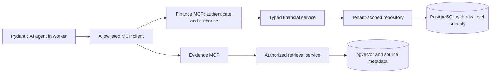

# MCP tool servers and conditional A2A delegation

Status: **first MCP slice implemented**. A stdio `cashflow-finance` server (`mcp` 2.x) serves `get_customer` and `list_customer_invoices` for one tenant fixed at launch. The client (Pydantic AI `MCPToolset`) starts it per role, filters tools by the allowlist in `config/mcp.toml`, and refuses a server whose advertised tools differ from the catalog. It is tested with real subprocesses and verified by `cashflow mcp-check`. Not yet built: authentication, HTTP transport, the evidence and collections servers, and any A2A work. No network endpoints or credentials exist. This extends [the implementation roadmap](implementation_plan.md), the [agent runtime](agent_runtime_plan.md), and the [evaluation harness](evaluation_harness_plan.md).

**Local first:** implement all required MCP servers, clients, authentication tests, and transport tests as local processes/containers. AWS deployment is optional. A separately deployed A2A peer can also be another container on the same machine; interoperability does not require cloud infrastructure.

## 1. Decision and protocol boundaries

**MCP is a required part of the project.** Serve the business tools through MCP and consume them through the application's configured MCP clients. Keep one implementation of each financial/retrieval/drafting service underneath the protocol adapter.

**A2A is conditional.** The three specialists initially share a LangGraph workflow and deployment lifecycle. Introduce A2A when a task must be delegated to a separately deployed agent with its own ownership/runtime, or as an explicitly selected interoperability exercise. There is no mandatory A2A hop between every graph node.

| Boundary | Mechanism | Project example |
| --- | --- | --- |
| UI to application | Authenticated application HTTP API | Submit a run or approve an exact draft |
| Workflow to internal specialist | LangGraph node invoking the shared Pydantic AI runner | Ask the investigator to examine overdue invoices |
| Agent host to tool/data capability | MCP client to MCP server | Fetch an invoice, calculate a forecast, search evidence |
| MCP server to database | Parameterized repository queries and database driver | Tenant-scoped PostgreSQL/pgvector access |
| Workflow to independently operated agent | A2A, if the decision gate is met | Delegate an exceptional dispute review and receive a review artifact |

MCP and A2A are complementary interfaces. MCP exposes capabilities; A2A supports collaboration with an agent that owns its task execution. This distinction does not mean every long-running operation requires A2A: evaluate the operation's ownership and supported protocol capabilities. [Official A2A/MCP comparison](https://a2a-protocol.org/latest/topics/a2a-and-mcp/)

## 2. Version compatibility comes first

Record a tested compatibility matrix for the MCP protocol revision, Python server SDK, Pydantic AI MCP client adapter and its transitive dependencies, transport, and authorization support. Resolve and lock actual versions during implementation; never track an unqualified `latest` dependency in a production build.

At planning review on 2026-09-26, the MCP `latest` specification resolves to **2026-07-28**, with a different request/capability lifecycle from older connection-initialization examples. Select a mutually supported revision and test its actual lifecycle; do not copy an old `initialize`/session sequence into every implementation. Prefer the maintained Python SDK and the supported Pydantic AI adapter over hand-written protocol parsing. [MCP specification](https://modelcontextprotocol.io/specification/2026-07-28), [transport/version compatibility](https://modelcontextprotocol.io/specification/2026-07-28/basic/transports), [Python SDK](https://github.com/modelcontextprotocol/python-sdk), [Pydantic AI MCP client](https://ai.pydantic.dev/mcp/client/)

The release manifest will record this matrix alongside tool schema/catalog hashes. A protocol or SDK upgrade must pass compatibility/security tests before promotion. The optional A2A implementation gets its own pinned protocol/SDK matrix rather than inheriting MCP versions.

## 3. MCP host, clients, and servers

Our worker application is the MCP host. Its trusted client manager opens connections to approved servers and attaches the right server-side identity/delegation. The LLM sees permitted tool schemas and tool results; it does not receive transport credentials or create arbitrary server connections.

| Server | Introduction | Served tools | Data authority |
| --- | --- | --- | --- |
| **Finance MCP** | Required milestone 06A | `get_cash_position`, `list_open_invoices`, `get_invoice`, `project_cashflow`, `get_collection_eligibility`, `get_customer_contact` | Read-only financial repositories and deterministic services |
| **Evidence MCP** | Skeleton in 06A; functional in 08 | `search_evidence`, `get_document_excerpt`, `get_policy` | Authorized documents, policy views, PostgreSQL/pgvector; retrieval-time model use only if explicitly configured/metered |
| **Collections MCP** | Scaffold/catalog in 06A; activate after phase 12 | `get_preferences`, `create_reminder_draft`, `get_draft` | Approved preferences and limited internal draft writes |

The collections server has no tool for approval, sending, arbitrary database writes, or credential management. Human approval stays in the application API; the deterministic executor owns delivery. If a future separately privileged execution MCP service is justified, it must preserve the existing exact-draft approval and idempotency checks and must not enter ordinary agent tool catalogs.

Keep a bounded catalog per specialist. For example, the analyst needs financial reads/projections; the investigator needs invoice and evidence reads; the collections assistant needs validated findings, contacts, preferences, and draft creation. A server can expose tools to multiple applications, but every application/actor still needs appropriate permission.

## 4. What database access through MCP means



A request such as `get_invoice(invoice_id="INV-A-1001")` becomes a validated MCP tool call. The server derives tenant/actor context from trusted credentials, checks permission and ownership, calls the same repository/service used by domain tests, and returns typed data with source/version/freshness fields.

MCP does not replace the PostgreSQL driver, transactions, migrations, or row-level security. Infrastructure work such as migrations, imports, ingestion, checkpoints, and execution-outbox transactions continues to use trusted direct database connections. For agent business queries, use the MCP route consistently once the servers are ready; do not silently fall back to direct SQL when a server is unavailable.

Do not give these agents a generic `execute_sql` tool. Expose bounded business queries with input schemas, query/row limits, statement timeouts, and tenant checks. A generic third-party database MCP server would need a separate capability/security review and should not be introduced simply to demonstrate MCP.

Use separate database roles for financial reads, authorized evidence reads, ingestion writes, and draft writes. Collections can write only the draft-related records it owns; it cannot edit settled payments or approval records. Scope connection pools and transaction-local tenant settings per request, and test pooled reuse across tenants.

## 5. Tools, resources, and prompts

Implement **tools first**. Define input/output schemas, stable names, result limits, typed errors, evidence references, and read/write behavior. Validate structured responses on the client before adding them to model context. Read-only/idempotency annotations aid discovery but do not enforce permissions or establish that a server is trustworthy. [MCP tools](https://modelcontextprotocol.io/specification/2026-07-28/server/tools)

Optionally expose evidence resources such as `cashflow://documents/{document_id}` after tool support works. Resource listing and reads require the same access checks as document tools; possession of a resource URI is not authorization. Prefer metadata-scoped resource access and bounded excerpts over unrestricted file access.

Keep prompts application-owned and versioned initially. Remote prompts, resource text, tool descriptions, and result text are data from another boundary, not a route for replacing system instructions or adding tool permissions. Do not enable optional server-driven capabilities or extensions unless a specific use case and compatible client/server tests justify them.

## 6. Transport and authorization design

### Local stdio lesson

1. Launch an allowlisted local server command using the pinned SDK.
2. Keep protocol messages on stdout and application logs on stderr.
3. Use an explicitly scoped fixture principal per server process/run; do not share mutable tenant context across simultaneous stdio clients.
4. Restrict inherited environment variables and files; do not pass all application secrets into the child process.
5. Demonstrate tool discovery and a financial query with a real subprocess client, not just a direct Python function call.

### Streamable HTTP application path

1. Run approved local endpoints for finance, evidence, and collections over Streamable HTTP, initially on loopback and then the Compose network. Local TLS exercises deployment-style security. Private AWS endpoints are an optional later mapping.
2. Configure transport lifecycle, capability/version metadata, timeouts, cancellation, and any streaming behavior against the chosen protocol revision.
3. Implement HTTP authorization with a token intended for the specific MCP resource. Validate issuer, intended recipient/audience as applicable, expiry, and scopes; follow the selected MCP authorization profile.
4. Bind each request to the initiating actor, active tenant, run, and permitted operation using a trusted run delegation. Verify that binding server-side against current membership/run policy.
5. Separate workload authentication from user delegation: a worker's identity alone must not authorize every tenant.
6. Use a local compatible authorization test issuer or trusted broker for short-lived resource-bound credentials/delegations. If the optional AWS track is later selected, separately verify Cognito/issuer capabilities; do not assume native token exchange or custom claim support without testing.
7. Do not forward the browser session cookie, a token issued for another service, or a QuickBooks token as an MCP credential. The server owns its own downstream credentials.
8. Restrict origins/hosts as required by the chosen transport, including local development; validate any authorization discovery URLs and redirects against SSRF/credential-forwarding risks.
9. Reauthorize calls after revocation/expiry. A transport session or connection ID, where supported, is never an authentication credential.

A tenant ID in tool arguments, request metadata, or an unsigned header cannot establish identity. Use a request-specific verified context; never mutate a globally shared client's authentication headers to switch users. Resource-specific OAuth and protection against token passthrough are documented MCP concerns. [MCP authorization](https://modelcontextprotocol.io/specification/2026-07-28/basic/authorization), [security guidance](https://modelcontextprotocol.io/docs/2026-07-28/tutorials/security/security_best_practices)

## 7. Configuration and directory additions

Add these proposed paths to the application skeleton:

```text
backend/config/
  mcp.toml
  a2a.toml                         # Disabled by default
backend/app/
  auth/delegation.py
  mcp/
    config.py
    client_manager.py
    toolsets.py
    catalog.py
    auth.py
    context.py
    errors.py
    resources.py
    servers/
      finance.py
      evidence.py
      collections.py
  a2a/                             # Created only if the decision gate passes
    config.py
    agent_card.py
    client.py
    server.py
    task_adapter.py
    authorization.py
    artifacts.py
tests/
  mcp/
  a2a/                             # Conditional
docker/
  Dockerfile.mcp
  Dockerfile.a2a                    # Conditional
```

`mcp.toml` should define approved server identities/endpoints, transport, supported protocol revisions, credentials/delegation provider references, server/tool allowlists by agent role, schema hashes, request/response limits, deadlines, concurrency, and retry rules. Settings are versioned application configuration, not an arbitrary protocol JSON file accepted from a user prompt.

`a2a.toml` should default to `enabled = false`. When enabled, specify approved remote card URLs/identities, pinned capabilities/versions, allowed skills, credential references, task deadline/polling limits, data-sharing policy, and artifact limits. Remote URLs or credentials must never be generated by the LLM.

## 8. Required MCP implementation sequence

1. Complete deterministic services and their direct unit/integration tests in phase 06.
2. Add milestone **06A**: compatibility spike, server/client scaffolding, request identity/delegation, and typed tool catalog.
3. Serve the finance tools with thin adapters; map protocol arguments into the existing service contracts.
4. Validate the catalog with an SDK client/inspector and record schema hashes. Enable only reviewed tools, even when discovery returns more.
5. Demonstrate a stdio call, then an authenticated Streamable HTTP call against the actual finance server.
6. Implement Pydantic AI MCP toolsets through `client_manager.py`; register only the tools permitted for the current agent role.
7. Connect phase 07's harness to real local MCP servers and preserve an in-process service test layer for fault diagnosis.
8. In phase 08, expose functional evidence tools and test RAG/citations through the network boundary.
9. In phases 09–10, run both the baseline and specialist agents through the same MCP tool surface for a fair comparison.
10. In phase 12, enable the collections server and test idempotent draft creation when the network fails after the server commits a draft.
11. In phases 16–17, complete local protocol compatibility, security, latency, reconnect/retry, container, and cross-service trace gates. Repeat/extend them in AWS only if optional phase 18 is selected.

**Acceptance:** the original financial/evidence cases pass through MCP; unauthorized calls fail at the server even when client-side filtering is bypassed; altered schemas or unexpected tools fail closed; draft retries do not create duplicates; worker code cannot bypass an outage by switching to a broader database credential.

## 9. Runtime and operational rules

The server-to-model path is not automatic. Finance and draft tools remain deterministic. Evidence embedding/reranking, if configured, uses the central profile/accounting contracts and exposes its usage so hidden server-side model costs do not escape the workflow budget.

A protocol request ID correlates an exchange; it is not an application idempotency key. For draft creation, bind a stable operation key to tenant/run/node/invoice/version, store it transactionally, and return the prior result after a retry. Scope any lookup for an uncertain operation with the same identity and ownership rules.

Handle transport faults separately from domain errors. Do not interpret an empty response, authentication failure, malformed result, or protocol mismatch as “no invoices.” Reads may retry within the total tool budget. Unknown write outcomes require reconciliation before a new write. Reconnecting does not reset budgets, membership checks, or workflow state.

Trace run ID -> agent invocation -> MCP client request -> server authorization/tool -> repository/retrieval -> response validation. Record server identity, protocol/catalog version, latency, redacted errors, usage, and authorization outcome. Share trace IDs safely; do not use trace metadata as proof of permission.

Use separate MCP server processes/roles in local Compose, reusing one image with explicit server entry points. Preserve that separation in a future optional AWS deployment. Keep any privileged executor outside ordinary agent-facing roles, and measure MCP latency and connection/pool limits locally first.

## 10. A2A decision gate and example

Record the decision at milestone **10A**, after the internal specialist workflow works. Build A2A only when at least one concrete condition holds:

- A different team/vendor owns a specialist with its own runtime, permissions, and release lifecycle.
- The specialist accepts a business task and returns its own progress/results, rather than exposing a bounded calculation/query.
- An interoperability lesson is explicitly selected, using a separate test deployment and measurable acceptance criteria.

If none applies, mark 10A **deferred by design**, keep `a2a.enabled = false`, and continue the core roadmap. Asynchronous work or having several agents alone is not a requirement for A2A.

The proposed optional exercise is a **Receivables Review Agent** operated as a separate local service/container. Our workflow delegates “review the evidence for Willow's disputed extra revisions and identify missing authorization.” It receives a minimal authorized evidence package and returns a typed review artifact with findings, evidence references, and unresolved questions. It cannot remove the dispute hold, approve a reminder, or send a message. The exercise requires no AWS account or externally hosted peer.

## 11. A2A implementation steps, if selected

1. Pin a supported A2A protocol/SDK and define the remote specialist's task, output artifact, skills, and identity.
2. Publish an Agent Card with supported interfaces and authentication requirements. Use approved discovery/card locations, such as the standard well-known card endpoint for the selected revision.
3. Authenticate the remote peer and caller, check current tenant/data-sharing permissions, and limit the skill it may execute. A card's claims are not proof of trust or authorization.
4. Implement an adapter from local run/delegation IDs to remote task/context IDs. Persist this mapping so a restart can retrieve existing work.
5. Submit a bounded task with a minimum necessary evidence package, never database credentials, approval authority, or the full tenant database.
6. Start with status polling; add authenticated streaming or push delivery only when required and separately tested.
7. Map remote completion, required input, rejection, failure, and cancellation into explicit local graph states. Remote completion does not automatically mean the business task is accepted or approved.
8. Validate returned artifact schemas, ownership, citation references, freshness, and content before incorporating them as evidence.
9. Define application-level duplicate submission/recovery semantics and task reconciliation; do not assume a message/task ID by itself guarantees exactly-once processing.
10. Apply total deadlines, bounded polling, cancellation handling, audit/trace correlation, and delegated-work budget accounting. If remote usage is unavailable, label the unknown cost and enforce available quotas.
11. Retain final approval/action control in our application's services. Bound delegation depth and prohibit recursive redelegation in this first exercise.
12. Test with a separate fake A2A server, then the selected real remote implementation; compare with an equivalent local reviewer on outcome, latency, cost, and operational complexity.

Agent Cards, task operations, artifacts, and authenticated interaction are part of the A2A specification; our particular delegation contract and authority restrictions are application design decisions. [A2A specification](https://a2a-protocol.org/latest/specification/)

**Acceptance if enabled:** an independently deployed agent completes the review through A2A; identity boundaries, restart/reconnect, input requests, cancellation, duplicate submission, and artifact validation pass; final approval remains local. If disabled, the core scenario remains fully functional and the report labels A2A as deferred, not tested.
