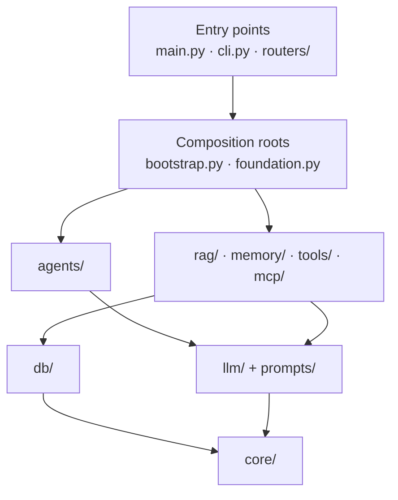

# `app/` — the backend package

Everything the backend runs lives in this package: the HTTP API, the command-line tool, the model layer, the agents, and the startup foundations (storage, retrieval, memory, tools, MCP). Each subdirectory has its own README; this one explains the files at the top level and how the packages fit together.

## Reading order

If you are new to the code, read it in this order. Each step only depends on the ones before it.

1. [`core/`](core/README.md): settings, the error hierarchy, the tenant scope, the clock.
2. [`llm/`](llm/README.md): the data contracts, the `ModelProvider` boundary, prompt loading, the runtime builder.
3. [`prompts/`](prompts/README.md): the versioned YAML prompts.
4. [`agents/`](agents/README.md): `BaseAgent` and the connection agent.
5. `bootstrap.py` (below): how a provider and an agent are assembled.
6. [`db/`](db/README.md): record contracts, tables, the engine, repositories, CSV import.
7. [`rag/`](rag/README.md), [`memory/`](memory/README.md), [`tools/`](tools/README.md), [`mcp/`](mcp/README.md): the startup bases.
8. `foundation.py`, `cli.py`, `main.py`, `database.py`, and [`routers/`](routers/README.md): the entry points.

## The top-level files

### `main.py` — the HTTP application

`create_app(location)` builds the FastAPI app for one project:

- adds CORS for the two local frontend origins (`FRONTEND_ORIGINS`: Vite on 5173, the Compose UI on 3000), allowing only `GET` and `POST`;
- includes the `health` and `diagnostics` routers;
- sets `_open_app_resources` as the **lifespan**: it runs once at startup, loads settings, opens one database engine, stores `location`, `settings`, and `engine` on `application.state`, and disposes of the engine at shutdown.

The module-level `app = create_app(ProjectLocation(root=DEFAULT_PROJECT_ROOT))` exists so `uvicorn app.main:app` can find it. Tests call `create_app` with a temporary project instead, so they never touch the real `.env` or database.

Why a lifespan and not globals: the engine has a lifetime (open, then dispose). Tying it to the app's startup and shutdown means there is exactly one engine per process and it is always closed. Startup opens the database but **never a model client**, so starting the server costs nothing and needs no key.

```bash
cd backend
.venv/bin/uvicorn app.main:app --reload     # http://localhost:8000
```

### `database.py` — the engine for routes

Two small functions for HTTP routes:

- `get_engine(request)` is a FastAPI dependency returning the engine the lifespan stored on `application.state`.
- `is_database_reachable(engine)` runs `SELECT 1` and returns `True` or `False`. It never raises for a database failure; the health route turns `False` into a 503.

The schema and repositories live in [`db/`](db/README.md); this module only hands routes the shared engine.

### `bootstrap.py` — the model-side composition root

The only module that names concrete providers and embedders. Everything else depends on the abstract classes (`ModelProvider`, `BaseEmbedder`), so swapping a vendor changes this file only.

| Function | What it does |
|---|---|
| `create_connection_agent(location, settings, *, vendor=None)` | Async context manager: loads prompt `connection/v1`, resolves the model profile, opens the provider, and yields a ready `ConnectionAgent`. Closes the SDK client on exit. |
| `open_model_provider(profile, settings)` | Opens the SDK client for the profile's vendor and yields its `ModelProvider`. The fixture opens no client. |
| `build_fixture_model(profile)` | The offline Pydantic AI `TestModel` scripted to return a valid `ConnectionOutput`. |
| `build_connection_agent(provider, prompt, profile)` | Assembles the runtime and the agent, without I/O. Tests call this directly. |
| `open_embedder(profile, settings)` | Yields the `HashingEmbedder` offline, or an OpenAI embedder (with its client) live. |
| `build_openai_embedder(profile, openai_client)` | Wraps a Pydantic AI `Embedder` in `PydanticAIEmbedder`. |
| `_require_api_key(settings, provider)` | Returns the vendor's key or raises `missing_credentials: set TEMPLATE_..._API_KEY`, naming the variable, never a value. |

Safety decisions made here, on purpose:

- **Pinned base URLs** (`OPENAI_BASE_URL`, `ANTHROPIC_BASE_URL`): an `OPENAI_BASE_URL` in your shell cannot redirect your key to another host.
- **`max_retries=0`** on every SDK client: a failed live probe costs one request, never a silent retry loop.
- **Opening a client sends no request.** Inference happens only in `BaseAgent.run_agent`.

### `foundation.py` — the startup composition root for data

`open_foundation(location, settings, *, clock=None)` validates the MCP and embedding catalogs, opens the database and the embedder, and yields a frozen `Foundation` dataclass holding every shared collaborator:

| Attribute | Type | Used for |
|---|---|---|
| `engine`, `database_url` | `AsyncEngine`, `str` | Storage; the URL is passed to MCP servers and never printed (`repr=False`). |
| `clock` | `Clock` | Preference expiry and timestamps. |
| `example_records` | `RecordRepository[ExampleRecord]` | The example record type. |
| `preference_records`, `preferences` | repository, `PreferenceMemory` | Stored preferences, and the reader of active ones. |
| `conversations` | `ConversationStore` | Message history per thread. |
| `embedder`, `vector_store`, `retriever` | `BaseEmbedder`, `VectorStore`, `Retriever` | Document retrieval. |
| `mcp_catalog` | `MCPCatalog` | Approved MCP servers and role allowlists. |

`build_foundation(...)` does the assembly without I/O, so tests can build a foundation over their own engine and fakes. `import_seed_data(foundation, directory)` loads one import directory (the CSVs in `STRUCTURED_SOURCES` plus an optional `preferences.json`) and is safe to rerun.

```python
import asyncio

from app.core.context import TenantScope
from app.core.settings import DEFAULT_PROJECT_ROOT, ProjectLocation, load_settings
from app.foundation import open_foundation
from app.rag.contracts import RetrievalQuery


async def search_policies() -> None:
    location = ProjectLocation(root=DEFAULT_PROJECT_ROOT)
    settings = load_settings(location, execution_mode="fixture")
    async with open_foundation(location, settings) as foundation:
        scope = TenantScope(tenant_id="tenant_alpha")
        results = await foundation.retriever.search_chunks(
            scope, RetrievalQuery(text="what needs a supporting document")
        )
        for result in results:
            print(result.chunk.document_id, round(result.score, 3))


asyncio.run(search_policies())
```

### `cli.py` — the command-line tool

Installed as `template-cli` (or run as `python -m app.cli`). Every command prints one JSON object and exits 0 on success, 1 on a known failure (`{"status": "failed", "reason": "<safe code>"}`).

| Command | What it does | Needs |
|---|---|---|
| `config-check` | Validates settings and all catalogs; prints the mode, model, embedding index, MCP servers, and which keys are *present* (never their values). | — |
| `smoke` | Runs the connection agent once through the fixture model. | — |
| `smoke --live [--provider openai\|anthropic]` | Sends **one** hosted request. | That vendor's key |
| `data-import --directory …` | Imports one records directory. | — |
| `index-documents --directory … [--live]` | Chunks, embeds, and stores a document directory. | OpenAI key with `--live` |
| `search --tenant … --query … [--live]` | Semantic search over that tenant's chunks. | OpenAI key with `--live` |
| `mcp-check --tenant …` | Starts every role's MCP servers and verifies their tool catalogs. | — |

How it stays safe: `_select_execution_mode` returns `"live"` **only** when `--live` is passed, so a `TEMPLATE_MODEL_MODE=live` line in `.env` can never turn an ordinary command into a paid call. `_validate_options` rejects misplaced options before anything runs, naming the option and never its value. SDK loggers are silenced so stdout carries only the JSON summary.

## How the packages depend on each other



Arrows point from a module to what it imports. Every package also imports `Contract` from `llm/contracts.py`; those edges are left out for readability. Two rules keep this graph clean:

1. **Concrete classes are chosen in a few assembly points only.** `bootstrap.py` picks `OpenAIModelProvider` or `HashingEmbedder`; `foundation.py` picks `SqlRecordRepository` or `SqlVectorStore`. Two smaller assembly points do the same for their own job: `mcp/examples_server.py` (a separate process) and `db/csv_import.py`'s `import_structured_data`. Every other module receives its collaborators through `__init__` and types them by their abstract base, so tests pass in-memory fakes without patching anything.
2. **Every data object is a `Contract`.** `Contract` (in `llm/contracts.py`) is a frozen Pydantic model that rejects unknown fields and type coercion. Settings, records, tool arguments, search queries, and agent outputs all build on it, so bad data fails at the boundary where it enters, not deep inside.

## What is model judgement and what is deterministic

| Step | Who decides |
|---|---|
| The content of an agent's structured output | **The model** |
| Which tool to call and with which arguments (once tools are wired to an agent) | **The model** |
| Input validation, the one-request limit, deadlines, output schema validation, `_validate_output` | Deterministic code |
| Provenance (provider, model, prompt version and SHA-256, token usage) | Deterministic code; the model cannot set it |
| CSV import, chunking, embedding-based ranking (cosine similarity), preference expiry | Deterministic code |
| The tenant of every read (`TenantScope`) | Deterministic code; never a model argument |

## Errors

Every known failure is a subclass of `AppError` (see [`core/`](core/README.md)) whose message starts with a fixed code such as `storage_failed:` or `missing_credentials:`. Only the boundaries catch `AppError`: `run_cli`, the HTTP routes, and the MCP server. They pass on only `str(error)`. Anything that is not an `AppError` is a bug and is allowed to crash loudly.

## Where the tests are

`backend/tests/` has one file per area; each package README names its own. They run offline: `tests/conftest.py` removes `TEMPLATE_*` and vendor variables and makes any socket connection fail the test. For the top-level files: `test_api.py` covers `main.py`, `database.py`, and the routers; `test_bootstrap.py` covers `bootstrap.py`; `test_foundation.py` covers `foundation.py`; `test_cli.py` covers `cli.py`.

```bash
cd backend && .venv/bin/pytest
```
