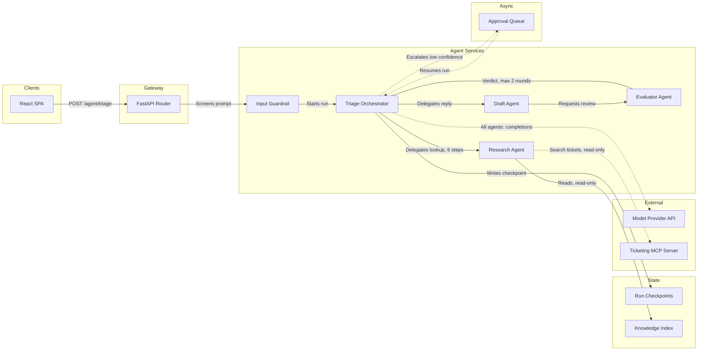

# Agentic System Design

> Decision sheets (placeholders until filled): [catalog Architecture](../catalog/README.md#architecture). This page is the long form for the pattern ladder and diagram rules.

Detailed reference for [`.cursor/skills/agentic-system-design/SKILL.md`](../../.cursor/skills/agentic-system-design/SKILL.md). The skill holds the rules; this page holds the reasoning, the worked example, and the record of what has actually been verified.

For how a diagram should *look* rather than what it should say, see [figma-draw-standards.md](figma-draw-standards.md).

## Why these rules

Traditional architecture diagrams answer "what talks to what". That is not the question that matters for an agentic system, because the interesting failures are not structural. A service that calls another service either works or returns an error. An agent that calls another agent can loop forever, quietly spend a budget, lose the thread of what it was asked, or take an irreversible action nobody approved.

So the standards optimize for one thing: **a diagram that makes the failure modes visible before the code is written.** Every rule traces back to a specific way these systems break.

| Rule | Failure it prevents |
|------|---------------------|
| Every loop shows its bound | Infinite planning loops and cascading tool calls that burn budget |
| Every tool edge names its side effect | An agent taking an irreversible action in a path nobody reviewed |
| Control flow says code-or-model | Nobody can tell what is testable and what is probabilistic |
| Human gates are nodes | Approval treated as an afterthought, with no defined waiting state |
| State is on the picture | Context overflow and runs that cannot resume after a restart |
| Mermaid is committed | Diagrams that drift from the code and are still trusted |

The second point is worth dwelling on. Most agent failures are design failures, not model failures — unbounded loops, context overflow, no way to inspect a decision, no guardrail when a tool call goes sideways. All four are invisible on a conventional box-and-arrow diagram, which is exactly why a conventional diagram gives false confidence about an agentic system.

## The ladder, and why it points downward

The pattern ladder in the skill is ordered by autonomy, and the instruction is to stop at the first rung that works. This runs against the instinct to build the impressive thing.

The reason is cost asymmetry. Moving from a prompt chain to an autonomous agent buys flexibility on unpredictable inputs. It pays in latency (many sequential model calls), spend (each step is a full context), and debuggability (the path differs every run, so a failure may not reproduce). On a predictable task that a chain handles, you pay all three and buy nothing.

The canonical guidance is to add multi-step complexity **only when it demonstrably improves outcomes**. "Demonstrably" is the operative word, and it is why the skill asks for the measurement to be written down. Without that note, the next person cannot tell whether rung 6 was chosen because it was needed or because it was interesting.

The practical version: build rung 2, measure it, and let it fail before building rung 5.

### Patterns compose

The rungs are not exclusive. A router commonly feeds a chain; an orchestrator often wraps an evaluator-optimizer at the worker layer; parallelization sits inside any of them. When a design composes patterns, name each one in the diagram title — `L2 Topology — Routing into Orchestrator-Workers` — rather than inventing a new word for the combination.

## Three levels

The instinct to draw one diagram that shows everything produces a picture nobody reads. The fix is C4's core idea: separate levels, each for one audience, each answering one question.

- **L1 Context** — one box for the system, plus users and external systems. The question is "what is this for, and what does it touch?" A stakeholder should understand it without knowing the word "orchestrator".
- **L2 Topology** — agents, stores, queues, providers. The question is "what are the moving parts and how does work flow between them?" This is the diagram engineers argue over, and where classifying every component earns its keep.
- **L3 Loop** — one run as a sequence. The question is "what actually happens, step by step, and where does it stop?" This is where budgets, retries, and human gates become concrete.

Three diagrams, three files, one board.

Borrow C4's discipline of levels, not its notation. Which diagram types a renderer supports is a drawing question; for Figma it is answered in [figma-draw-standards.md](figma-draw-standards.md#unsupported-diagram-types).

## Why Mermaid is the source of truth

A Figma board is a rendering. The artifact under version control is the `.mmd` file in [`diagrams/`](../diagrams/).

Three reasons, all learned the expensive way in other projects:

**It diffs.** A renamed service shows up as one changed line in a pull request. In a board, it shows up as nothing, and the diagram silently becomes a lie.

**It regenerates.** When the topology changes, edit text and regenerate rather than dragging boxes. Hand-arranged layout is work you have to redo every time.

**It travels.** The same source renders in GitHub, in the wiki, and on the board. A board link renders in exactly one place and requires an account.

The rule that a hand-edit must be ported back within the session, or discarded, is the part that actually keeps this true. Every stale-diagram problem starts with one quick fix made directly on the canvas that nobody wrote down.

What the board is genuinely better at: sticky-note commentary during a design review, per-node highlighting while walking a group through a flow, and spatial arrangement that carries meaning a generator would not infer. Do that work **after** generating, and treat it as annotation rather than structure.

## Classifying every component

The skill asks three questions of every box: who runs it, whether its state is durable, and whether a model decides inside it. Frameworks tend to blur all three, and each blur hides an operational fact:

- An **agent is code we deploy**, scale, and page someone about. Framework vocabulary sometimes makes agents feel like a separate species; operationally they are not.
- A **guardrail is its own component**, not part of the entry point. It is a distinct thing that can fail independently.
- **Memory is durable state.** Frameworks bundle memory into the agent object, which hides that it has a retention policy and a growth curve.
- The **model provider is a third party**, with a rate limit, an outage history, and a bill.
- **Model-driven or deterministic** decides the test strategy: unit tests for one, evaluations for the other.

The pressure to answer "is this ours or not, is it durable or not, does a model decide" for every box is itself worth the exercise. In Figma the first two answers become the lane and the third becomes the double border; the lane rules and why they behave like an architecture linter are in [figma-draw-standards.md](figma-draw-standards.md#the-six-lanes-and-why-agentic-systems-fit-them).

## Worked example: a triage agent for this app

This repository currently implements one endpoint, a health check ([architecture.md](../reference/architecture.md)). Suppose we add an agentic `/agent/triage` that answers support questions over ticket history.

### The bad version

The first draft of almost every agentic diagram looks like this:

```
[User] → [AI Agent] → [Database]
              ↓
          [LLM API]
```

Everything wrong with it is an omission. `AI Agent` is one box covering orchestration, retrieval, drafting, and review — four responsibilities and four independent failure modes. No loop bound, so nothing says whether this terminates. No tool side effects, so nobody knows whether it can write. No human gate, so escalation is undesigned. No state, so nobody has asked what happens if the process restarts mid-run. It is a picture of an intention, not a design.

### The good version



The same system, with the four omissions filled in. It is rung 5 composed with rung 6 — orchestrator-workers wrapping an evaluator-optimizer — and the title should say so.

Read what the labels now commit to. `6 steps` and `max 2 rounds` mean the loops terminate and someone chose the number. `read-only` on both tool edges means this agent cannot mutate a ticket, which is a security property visible at a glance. `Run Checkpoints` means a restart resumes rather than restarting. `Approval Queue` in the `async` lane means escalation has a defined waiting state instead of a blocked request.

Note the single provider edge labeled `All agents: completions`. Drawing one edge per agent would add four lines that all say the same thing. Draw separate edges only where the model or its configuration genuinely differs — then the difference is the information.

The Mermaid above is written in the renderable architecture form from [figma-draw-standards.md](figma-draw-standards.md), which is why the evaluator's feedback is a backward edge; the design point is only that the loop is explicit and carries its bound.

## Visual standards

Moved. The shape, color, border and label vocabulary for every component — and the reasoning behind it, including the measured colour-blindness figures that forced a palette rebuild — is [figma-draw-standards.md](figma-draw-standards.md).

The division of labour: this page decides *what to draw and what it must say*; that page decides *what it looks like*. Keep them separate, because they change for different reasons. A new agent pattern changes this page. A legibility problem changes that one.

## Sources

Agent patterns and the workflow/agent distinction: [Building Effective AI Agents](https://www.anthropic.com/research/building-effective-agents) · [Agentic design pattern catalog](https://www.augmentcode.com/guides/agentic-design-patterns) · [Google Cloud: choose a design pattern for agentic AI](https://docs.cloud.google.com/architecture/choose-design-pattern-agentic-ai-system) · [Databricks agent system design patterns](https://docs.databricks.com/aws/en/generative-ai/guide/agent-system-design-patterns)

Figma MCP, the generator's constraints, and Figma conventions, with their verification status: [figma-draw-standards.md](figma-draw-standards.md#sources).

Architecture modeling and observability: [C4 primitives for AI/ML systems](https://github.com/JGalego/AI-C4) · [Collaborative LLM agents for C4 design automation](https://arxiv.org/pdf/2510.22787) · [OpenTelemetry GenAI observability](https://opentelemetry.io/blog/2026/genai-observability/) · [GenAI semantic conventions](https://www.dash0.com/knowledge/opentelemetry-genai-semantic-conventions-explained)

Accessibility: [Colour blind friendly colours](https://wearearch.com/blog/color-blind-friendly-colours) · [Accessible colour palette guide](https://accessibility.build/guides/accessible-color-palettes)
