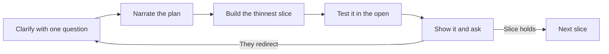

# The FDE Mental Model

How work moves from "we don't know what the problem is" to "an agent runs this in production and someone owns it." This page is the spine of the wiki: every other page is a component hanging off one of these phases.

Read this first. It is the map; the rest is territory.

Decision sheets live in [catalog/](catalog/README.md) — one card, one family. Most of those files are placeholders until we write them one by one. Phase folders keep method and long form. Do not recreate retired phase page names listed in [wiki/README.md](README.md#retired-names).

## Two loops, not one

**The outer loop is the engagement.** Six phases, each with an exit condition. It is not a waterfall — the dotted edges below are the ones that matter most, because they are how the design gets corrected by contact with reality.

**The inner loop is the increment.** It runs in minutes, many times inside every phase, and it is the loop a client actually experiences you through. Most technical people have the outer loop and skip the inner one.

```mermaid
flowchart LR
    subgraph frame ["1 · FRAME"]
        f1[Understand the problem]
        f2[Qualify the automation]
        f3[Shape and slice the solution]
    end
    subgraph design ["2 · DESIGN"]
        d1[Pick the pattern]
        d2[Split model vs code decisions]
        d3[Design triggers, tools, state]
        d4[Place guardrails and gates]
    end
    subgraph build ["3 · BUILD"]
        b1[Data model and migrations]
        b2[API and event contracts]
        b3[Agent runtime and tools]
        b4[Dashboard and approvals UI]
    end
    subgraph prove ["4 · PROVE"]
        p1[Deterministic tests]
        p2[Trajectory and eval set]
        p3[Debug and fix]
    end
    subgraph operate ["5 · OPERATE"]
        o1[Observability and cost]
        o2[Security and least privilege]
        o3[Reliability and recovery]
        o4[Staged rollout]
    end
    subgraph land ["6 · LAND"]
        l1[Demo and hand off]
        l2[Spot cross-customer patterns]
    end

    f1 --> f2
    f2 --> f3
    f3 --> d1
    d1 --> d2
    d2 --> d3
    d3 --> d4
    d4 --> b1
    b1 --> b2
    b2 --> b3
    b3 --> b4
    b4 --> p1
    p1 --> p2
    p2 --> p3
    p3 --> o1
    o1 --> o2
    o2 --> o3
    o3 --> o4
    o4 --> l1
    l1 --> l2
    b3 -.->|"Reality contradicts the scope"| f3
    p3 -.->|"Evals expose a design flaw"| d2
    o3 -.->|"Incidents expose a missing guardrail"| d4
    l2 -.->|"Patterns become product"| f1
```



Solid edges are the forward path; dotted edges are feedback. A team that never travels a dotted edge is not learning, it is shipping its first guess.

### The inner loop



Narrate *before* building, not after. The difference between an engineer and a consultant is that the client knows what you are about to do and had a chance to stop you.

## Phase 1 · Frame

*Exit condition: a written problem statement with a number in it, and an agreed first slice.*

| Component | The question it answers |
|---|---|
| Problem statement | Who hurts, how often, what it costs today |
| Stakeholder map | Who decides, who uses it, who gets blamed when it breaks |
| Current-state trace | What actually happens now, step by step, including the spreadsheet nobody mentions |
| Success metric | What number moves, measured how, baselined at what |
| Constraint capture | Systems, data access, compliance, latency, budget, who can say no |
| Automation qualification | Should this be a rule, a workflow, or an agent — and the cost of being wrong |
| Scope slice | The thinnest thing that is end-to-end useful |
| Demo milestone | What we will show, and when |

The qualification step is the one people skip. **Not every problem deserves an agent**, and saying so is a credibility move, not a lost sale. An agent earns its cost when the task is genuinely hard to specify in advance, the value justifies the latency and spend, and errors are catchable.

## Phase 2 · Design

*Exit condition: L1/L2/L3 diagrams, and every loop in them has a bound.*

| Component | The question it answers |
|---|---|
| Pattern selection | Chain, route, parallel, orchestrator-workers, evaluator, or autonomous |
| **Model-vs-code decision split** | Which decisions a model makes and which stay deterministic |
| Trigger design | Event, schedule, or manual — and what happens on a duplicate |
| Action surface | What the agent can do, what it can only read, what needs a human |
| State and memory | What survives a step, a run, a restart; what gets forgotten and when |
| Context engineering | What goes in the window, in what order, and what gets cached |
| Guardrails and gates | Input screening, output validation, approval points |
| Failure and fallback | What happens when the model is wrong, slow, or down |
| Diagrams | [agentic-system-design](2-design/agentic-system-design.md), [figma-draw-standards](2-design/figma-draw-standards.md) |

**The model-vs-code split is the single highest-leverage decision in the whole arc.** Put too much in the model and the system is untestable and expensive; put too little and you built a rules engine with a language model bolted on. The default that holds up: the model *classifies, extracts, and drafts*; code *decides, routes, and writes*. A threshold comparison is never a model's job.

## Phase 3 · Build

*Exit condition: a vertical slice runs end to end against real data.*

| Component | The question it answers |
|---|---|
| Domain model and migrations | What the records are, and how schema changes ship |
| REST API design | Resources, status codes, pagination, versioning, errors |
| Event and webhook contracts | Payload shape, delivery guarantees, replay, signature verification |
| Idempotency | What happens when the same trigger fires twice |
| Tool/function schemas | Typed, strict, described well enough that the model uses them right |
| Agent runtime | The loop, tool dispatch, retries, timeouts, budget enforcement |
| Prompt and context assembly | System prompt, few-shot, retrieved context, caching boundaries |
| Structured outputs | How a response becomes a validated object, not a string to parse |
| MCP | When to expose tools over MCP rather than call them in-process |
| Error taxonomy | Retryable vs terminal vs needs-a-human, and how each surfaces |
| Frontend | Dashboard, run inspector, approvals queue |

The **run inspector** is worth calling out. An agent feature without a UI that shows *why it did what it did* is unsupportable — the first question from operations will be "why did it reject mine?", and "let me check the logs" is the wrong answer.

## Phase 4 · Prove

*Exit condition: a suite that fails when the agent gets worse.*

| Component | The question it answers |
|---|---|
| Test pyramid | What is mocked, what is live, and where the line sits |
| Deterministic unit tests | Schema validity, policy math, routing logic — no model in the loop |
| Contract tests | The API and webhook shapes hold |
| Trajectory tests | The right tools got called, in the right order, with the right args |
| Golden eval set | Frozen cases with known-good outcomes, scored on every change |
| LLM-as-judge | Rubric scoring for free-text output, with the rubric under review |
| Non-determinism handling | `pass@k` rather than `pass@1`, and thresholds per agent maturity |
| Regression gate | What blocks a merge |
| Debugging playbook | How to go from "it did something weird" to a root cause |

The rule that keeps this honest: **mock the model in unit tests, never in behavioral tests.** Mocking the model in a test of the model's decisions produces a suite that passes while the agent is broken.

## Phase 5 · Operate

*Exit condition: someone who is not you can run it, and knows what to do at 3am.*

| Component | The question it answers |
|---|---|
| Tracing | Every model call, tool call, and decision point, on one trace ID |
| Metrics and cost | Tokens, latency, spend per run, failure and fallback rates |
| Budget controls | Step caps, spend caps, and what happens at the cap |
| Least privilege | Scoped credentials per tool; read-only where possible |
| Prompt injection defense | Untrusted content is data, never instruction |
| Tool misuse and excessive agency | The agent cannot do more than its job requires |
| Audit trail | Immutable record of every decision, with the evidence behind it |
| Reliability | Retries with backoff, circuit breakers, dead-letter queues, replay |
| Staged rollout | Shadow → suggest → act-with-approval → act-autonomously |
| SLOs and alerts | What "healthy" means numerically, and who gets paged |
| Runbooks | The named failure modes and their fixes |

Staged rollout is the answer to "how do you deploy an agent safely," and it is a better answer than any amount of pre-launch testing. **Shadow mode first** — the agent decides, writes its decision to the audit log, and changes nothing — gives you a real eval set from production traffic at zero risk.

## Phase 6 · Land

*Exit condition: they use it without you, and you learned something reusable.*

| Component | The question it answers |
|---|---|
| Demo and walkthrough | Can they see the value, and explain it to their boss |
| Handoff docs and enablement | Can their team change it |
| Decision log | Why it is built this way, for whoever inherits it |
| Cross-customer pattern spotting | What did we build here that three other customers also need |

The last row is the difference between a contractor and an FDE. **Patterns seen at customer sites are the strongest product signal a company has**, and carrying them back is part of the job.

## Cross-cutting

These do not belong to a phase; they run through all six.

| Component | Why it is cross-cutting |
|---|---|
| **Consulting craft** | Narrate before building, ask before assuming, listen for hints, demo early |
| Incremental delivery | Thin vertical slices, always something runnable |
| Decision records | Capture the why at the moment of the choice |
| Coding standards | [reference/coding-standards.md](reference/coding-standards.md) |
| Diagram standards | [2-design/figma-draw-standards.md](2-design/figma-draw-standards.md) |

## What a 90-minute exercise actually exercises

The full arc is the career. A live exercise compresses it, and the compression is uneven — some phases become a sentence, others become the whole session.

| Phase | In 90 minutes | Weight |
|---|---|---|
| 1 Frame | 2-3 clarifying questions before touching the keyboard, restated scope | **Hot** |
| 2 Design | Stating the model-vs-code split out loud before coding it | **Hot** |
| 3 Build | Event-triggered agent, conditional logic, follow-up action, scheduled report | **Hottest** |
| 4 Prove | Naming the tests before writing them; one real test that runs | **Hot** |
| 5 Operate | Mostly spoken: what you'd add before this goes live, and why | **Hot — this is the VP's question** |
| 6 Land | The closing walkthrough, plus cross-customer instinct if asked | Medium |

Two phases are worth more than their code volume. **Phase 1 costs three minutes and frames everything after it.** Phase 5 is usually never built in the session but is where "production-ready" is judged — having a crisp, ordered answer to "what would you add before launch" is worth more than another endpoint.

The exercise shape named in the brief — *react to a new record, apply conditional business logic, take a follow-up action, plus a scheduled report* — is exactly Phase 3's four rows. Both triggers show up: event-driven and cron.

## Skills roadmap

Catalog cards hold the decision; `.cursor/skills/` holds the rules an agent applies. **Do not add placeholder `SKILL.md` files.** Full list: [`.cursor/skills/README.md`](../.cursor/skills/README.md).

| Skill | Covers | Status |
|---|---|---|
| [coding-standards](../.cursor/skills/coding-standards/SKILL.md) | Naming, docstrings, Pydantic contracts, function design, ABCs and OOP, tests | **Built** |
| [fde-engagement](../.cursor/skills/fde-engagement/SKILL.md) | Discovery, qualification, slicing, narration, demo, handoff | **Built** |
| [agentic-system-design](../.cursor/skills/agentic-system-design/SKILL.md) | Pattern ladder, diagram levels, what to show | **Built** |
| [figma-draw-standards](../.cursor/skills/figma-draw-standards/SKILL.md) | Shape, colour, border, edge notation | **Built** |
| `retrieval-and-memory` | Chunk, embed, retrieve, remember | Planned — after Retrieval cards |
| `workflow-patterns` | Record-triggered work, approvals, scheduled reports | Planned |
| `claude-integration` | Tools, structured outputs, the loop, current Claude API | Planned |
| `api-and-integration` | REST, webhooks, data model, migrations | Planned |
| `testing-and-evals` | Pyramid, golden sets, judges | Planned |
| `production-readiness` | Observability, security, reliability, rollout | Planned |
| `orient-scaffold` | First 15 minutes in this repo | Planned |

Each skill owns a distinct **moment**. Cursor selects by description match; overlapping descriptions make selection worse.

Skills load on demand. The always-on layer is [`.cursor/rules/engagement.mdc`](../.cursor/rules/engagement.mdc): **rules load into every prompt and override skills on conflict**, so only what must always hold belongs there.

## Directory map

```
wiki/
├── mental-model.md      this page — the spine
├── catalog/             decision cards (many still placeholders)
├── 1-frame/             consulting craft + long-form discovery
├── 2-design/            pattern ladder + diagram notation
├── 3-build/             three workflow shapes
├── 6-land/              demo, handoff
├── reference/           this project: setup, architecture, standards, traps
└── diagrams/            Mermaid sources, the version we trust

.cursor/
├── rules/engagement.mdc always-on working agreement (wins on conflict)
└── skills/              only real SKILL.md files — see skills/README.md

context/
├── repo-map.md          observed facts about the scaffold
└── session-notes.md     live scope, assumptions, verified-vs-assumed

practice/                timed rehearsal scenarios
```

## Open decisions

Settled:

1. **Depth.** Catalog cards are short decision sheets. Phase pages are method / long form.
2. **Phase 1.** `fde-engagement` already carries question banks and phrasing; catalog Engagement cards distill the decisions.

Still open:

3. **Domain grounding.** Worked examples against expense/AP, or keep them generic?
4. **Scaffold gaps.** Pre-stage verified install commands for the missing AI SDK, pytest, HTTP client, and migrations, given the npm problems in [reference/troubleshooting.md](reference/troubleshooting.md)?
